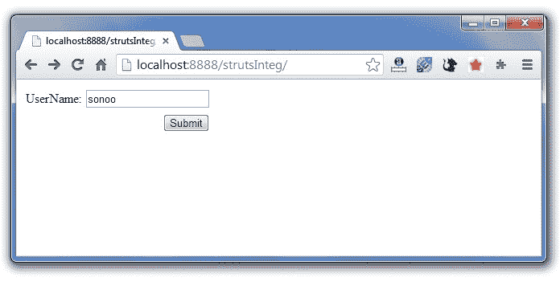
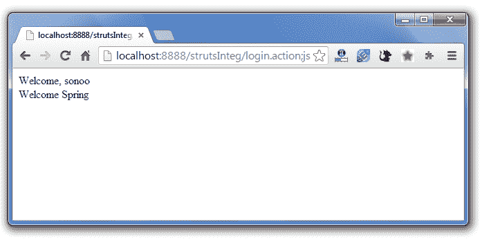

# 弹簧和支柱 2 集成

> 原文：<https://www.javatpoint.com/spring-and-struts2-integration>

1.  [弹簧和支柱 2 集成](#)
2.  [弹簧和支柱 2 集成示例](#ex)

Spring 框架提供了一种管理依赖关系的简单方法。它可以很容易地与 struts 2 框架集成。

**ContextLoaderListener** 类用于将 spring 应用程序与 struts 2 通信。它必须在 web.xml 文件中指定。

* * *

您需要遵循以下步骤:

1.  创建 struts2 应用程序并添加 spring jar 文件。
2.  在 **web.xml** 文件中，定义 ContextLoaderListener 类。
3.  在 **struts.xml** 文件中，定义动作类的 bean 名称。
4.  在 **applicationContext.xml** 文件中，创建 bean。它的类名应该是动作类名，例如 com.javatpoint.Login 和 id 应该与 struts.xml 文件的动作类相匹配(例如 Login)。
5.  在**动作类**中，定义额外的属性，例如消息。

* * *

### Spring 和 Struts 2 集成示例

您需要为简单的 spring 和 struts 2 应用程序创建以下文件:

1.  **index.jsp**
2.  **web.xml**
3.  **struts.xml**
4.  **applicationContext.xml**
5.  **Login.java**
6.  **welcome.jsp**
7.  **error.jsp**

**1) index.jsp**

此页面从用户处获取名称。

```java
<%@ taglib uri="/struts-tags" prefix="s"%>

<s:form action="login">
<s:textfield name="userName" label="UserName"></s:textfield>
<s:submit></s:submit>
</s:form>

```

* * *

**2) web.xml**

它为 struts2 和 **ContextLoaderListener** 侦听器类定义了控制器类，以便在 struts 2 和 spring 应用程序之间建立连接。

```java
<?xml version="1.0" encoding="UTF-8"?>
<web-app version="2.5" 

	xmlns:xsi="http://www.w3.org/2001/XMLSchema-instance" 
	xsi:schemaLocation="http://java.sun.com/xml/ns/javaee 
	http://java.sun.com/xml/ns/javaee/web-app_2_5.xsd">
  <welcome-file-list>
    <welcome-file>index.jsp</welcome-file>
  </welcome-file-list>
  <filter>
  	<filter-name>struts2</filter-name>
  	<filter-class>
  		org.apache.struts2.dispatcher.ng.filter.StrutsPrepareAndExecuteFilter
  	</filter-class>
  </filter>

<listener> 
<listener-class>org.springframework.web.context.ContextLoaderListener</listener-class> 
</listener> 

  <filter-mapping>
  	<filter-name>struts2</filter-name>
  	<url-pattern>/*</url-pattern>
  </filter-mapping>

  </web-app>

```

* * *

**3) struts.xml**

它用动作和结果来定义包。这里，操作类名是 login，将在 applicationContext.xml 文件中搜索。

```java
<?xml version="1.0" encoding="UTF-8" ?>
<!DOCTYPE struts PUBLIC "-//Apache Software Foundation//DTD Struts Configuration 2.1//EN" 
"http://struts.apache.org/dtds/struts-2.1.dtd">
<struts>
<package name="abc" extends="struts-default">
<action name="login" class="login">
<result name="success">welcome.jsp</result>
</action>

</package>

</struts>    

```

* * *

**4) applicationContext.xml**

它定义了一个 id 为 login 的 bean。这些豆子相当于我的背包。登录类。这里将被视为行动类。

它应该位于 WEB-INF 目录中。

```java
<?xml version="1.0" encoding="UTF-8"?>
<beans

	xmlns:xsi="http://www.w3.org/2001/XMLSchema-instance"
	xmlns:p="http://www.springframework.org/schema/p"
	xsi:schemaLocation="http://www.springframework.org/schema/beans 
http://www.springframework.org/schema/beans/spring-beans-2.5.xsd">

<bean id="login" class="mypack.Login">
<property name="message" value="Welcome Spring"></property>
</bean>

</beans>

```

* * *

**5) Login.java**

它用返回成功的执行方法定义了两个属性用户名和消息。

```java
package mypack;
public class Login {
private String userName,message;

public String getMessage() {
	return message;
}
public void setMessage(String message) {
	this.message = message;
}
public String getUserName() {
	return userName;
}
public void setUserName(String userName) {
	this.userName = userName;
}
public String execute(){
	return "success";
}
}

```

* * *

**6) welcome.jsp**

它打印用户名和消息属性的值。

```java
<%@ taglib uri="/struts-tags" prefix="s"%>

Welcome, <s:property value="userName"/><br/>
${message} 

```

* * *

**7) error.jsp**

这是错误页面。但是在这个例子中并不需要，因为我们没有在 action 类的 execute 方法中定义任何逻辑。

```java
Sorry! 

```

[download this example (developed using Myeclipse IDE)](https://static.javatpoint.com/src/sp/strutsInteg.zip)

#### 输出


