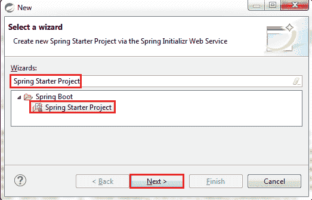
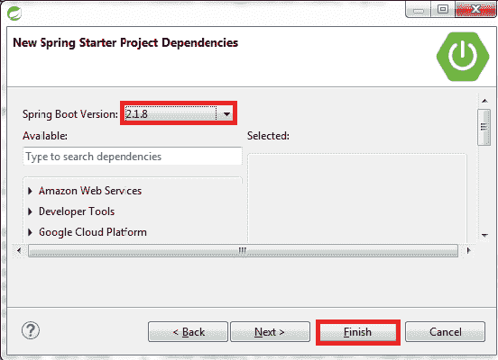
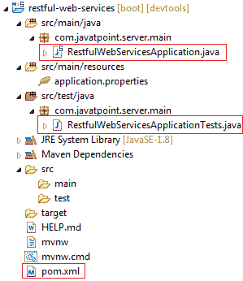

# 用 Spring Boot 初始化一个 RESTful 网络服务项目

> 原文：<https://www.javatpoint.com/restful-web-services-example>

**第一步:**从[https://spring.io/tools3/sts/all](https://spring.io/tools3/sts/all)下载**Spring 工具套件(STS)** 并解压。

**第二步:**启动 **STS** 。

**第三步:**点击**文件菜单- >新建- >Spring 开学项目- >**


如果**Spring 开学项目**未报名，则点击菜单底部的**其他**。屏幕上会出现一个对话框。在**向导**文本框中输入**Spring 起动器项目**，点击**下一步**按钮。



**步骤 4:** 提供项目的名称、组和包。我们提供了:

名称: **restful-web-services**

小组: **com.javatpoint**

套餐:**com . javatpoint . server . main**

点击**下一步**按钮。


**第五步:**选择 Spring Boot 版 **2.1.8** 。



**第六步:**我们可以在项目浏览器窗口中看到项目结构。



**步骤 7:** 转到 Maven 资源库[https://mvnrepository.com/](https://mvnrepository.com/)并在 pom.xml 中添加 **Spring Web MVC、Spring Boot DevTools、JPA、**和 **H2** 依赖项。

POM . XML

```java
<project 
  xmlns:xsi="http://www.w3.org/2001/XMLSchema-instance"
  xsi:schemaLocation="http://maven.apache.org/POM/4.0.0
                      http://maven.apache.org/xsd/maven-4.0.0.xsd">
<modelVersion>4.0.0</modelVersion>
<parent>
<groupId>org.springframework.boot</groupId>
<artifactId>spring-boot-starter-parent</artifactId>
<version>2.1.8.RELEASE</version>
<relativePath/> <!-- lookup parent from repository -->
</parent>
<groupId>com.javatpoint</groupId>
<artifactId>restful-web-services</artifactId>
<version>0.0.1-SNAPSHOT</version>
<name>restful-web-services</name>
<description>Demo project for Spring Boot</description>
<properties>
<java.version>1.8</java.version>
</properties>
<dependencies>
<dependency>
<groupId>org.springframework.boot</groupId>
<artifactId>spring-boot-starter</artifactId>
</dependency>
<dependency>
<groupId>org.springframework.boot</groupId>
<artifactId>spring-boot-starter-activemq</artifactId>
</dependency>
<dependency>
<groupId>org.springframework.boot</groupId>
<artifactId>spring-boot-starter-web</artifactId>
</dependency>
<dependency>
<groupId>org.springframework.boot</groupId>
<artifactId>spring-boot-starter-tomcat</artifactId>
</dependency>
<dependency>
<groupId>org.springframework</groupId>
<artifactId>spring-webmvc</artifactId>
</dependency>
<!-- https://mvnrepository.com/artifact/org.springframework.boot/spring-boot-devtools -->
<dependency>
<groupId>org.springframework.boot</groupId>
<artifactId>spring-boot-devtools</artifactId>
<scope>runtime</scope>
</dependency>
<!-- https://mvnrepository.com/artifact/org.hibernate.javax.persistence/hibernate-jpa-2.1-api -->
<dependency>
<groupId>org.hibernate.javax.persistence</groupId>
<artifactId>hibernate-jpa-2.1-api</artifactId>
<version>1.0.0.Final</version>
</dependency>
<!-- https://mvnrepository.com/artifact/com.h2database/h2 -->
<dependency>
<groupId>com.h2database</groupId>
<artifactId>h2</artifactId>
<scope>runtime</scope>
</dependency>
<dependency>
<groupId>org.apache.maven</groupId>
<artifactId>maven-archiver</artifactId>
<version>2.5</version>
</dependency>
<dependency>
<groupId>org.springframework.boot</groupId>
<artifactId>spring-boot-starter-test</artifactId>
<scope>test</scope>
</dependency>
</dependencies>
<build>
<plugins>
<plugin>
<groupId>org.springframework.boot</groupId>
<artifactId>spring-boot-maven-plugin</artifactId>
</plugin>
</plugins>
</build>
</project>

```

**第 8 步:**现在打开**RestfulWebServicesApplication.java**文件，以 Java Application 运行该文件。

```java
package com.javatpoint.server.main;
import org.springframework.boot.SpringApplication;
import org.springframework.boot.autoconfigure.SpringBootApplication;
@SpringBootApplication
public class RestfulWebServicesApplication 
{
public static void main(String[] args) 
{
SpringApplication.run(RestfulWebServicesApplication.class, args);
}
}

```

它不执行任何服务，但确保应用程序正常运行。

**输出**


## 创建你好世界服务

**第一步:**在包**中新建一个名为 **HelloWorldController** 的类。**

**第二步:**每当我们创建一个 web 服务时，我们需要定义两件事**获得**方法和 **URI** 。现在创建 **helloWorld()** 方法，返回字符串“helloWorld”如果我们想告诉 spring MVC 它将要处理 REST 请求，我们就必须添加 **@RestController** 注释。现在它变成了一个休息控制器，可以处理休息请求。

接下来我们要做的是为该方法创建一个映射。在 helloWorld()方法的正上方添加 **@RequestMapping** 注释。HelloWorldController 如下所示:

```java
package com.javatpoint.server.main;
import org.springframework.web.bind.annotation.RequestMapping;
import org.springframework.web.bind.annotation.RequestMethod;
import org.springframework.web.bind.annotation.RestController;
//Controller
@RestController
public class HelloWorldController 
{
//using get method and hello-world as URI
@RequestMapping(method=RequestMethod.GET, path="/hello-world")
public String helloWorld()
{
return "Hello World";
}
}

```

我们也可以通过使用 **@GetMapping** 注释而不是@RequestMapping 来改进上面的代码。这里不需要方法说明。

```java
package com.javatpoint.server.main;
import org.springframework.web.bind.annotation.GetMapping;
import org.springframework.web.bind.annotation.RestController;
//Controller
@RestController
public class HelloWorldController 
{
//using get method and hello-world as URI
@GetMapping(path="/hello-world")
public String helloWorld()
{
return "Hello World";
}
}

```

**步骤 3:** 运行**RestfulWebServiceApplication**。它在浏览器上显示字符串**你好世界**。

## 增强 Hello World 服务以返回一个 Bean

在本节中，我们将为方法 helloWorld()生成一个 bean。

**步骤 1:** 在**HelloWordController.java**文件中创建 **helloWorldBean()** 方法。将 URI 地图映射到“ **/hello-world-bean** ”并返回 **HelloWorldBean** 。

**hello world 控制器. java**

```java
package com.javatpoint.server.main;
import org.springframework.web.bind.annotation.GetMapping;
import org.springframework.web.bind.annotation.RestController;
//Controller
@RestController
public class HelloWorldController 
{
//using get method and hello-world URI
@GetMapping(path="/hello-world")
public String helloWorld()
{
return "Hello World";
}
@GetMapping(path="/hello-world-bean")
public HelloWorldBean helloWorldBean()
{
return new HelloWorldBean("Hello World"); //constructor of HelloWorldBean
}
}

```

**第二步:**创建一个类 **HelloWorldBean** 。

**步骤 3:** 生成吸气剂和**设置剂**。

右键单击->源->生成获取器和设置器->选中框->确定

**第 4 步:**生成 **toString()** ..

右键单击->源->生成字符串()..->好的

**HelloWorldBean.java**

```java
package com.javatpoint.server.main;
public class HelloWorldBean 
{
public String message;
//constructor of HelloWorldBean
public HelloWorldBean(String message)
{
this.message=message;
}
//generating getters and setters
public String getMessage()
{
return message;
}
public void setMessage(String message) 
{
this.message = message;
}
@Override
//generate toString
public String toString() 
{
return String.format ("HelloWorldBean [message=%s]", message);
}
}

```

**第五步:**启动 **HelloWorldController** 。浏览器的网址改为**本地主机:8080/hello-world-bean** 。

它以 JSON 格式返回消息“ **Hello World** ”。

```java
{
message: "Hello World"
}

```

[Click here to download Initializing a RESTful Web Service with Spring Boot project](https://static.javatpoint.com/tutorial/restful-web-services/download/Initializing a RESTful Web Service with Spring Boot.zip)
[Click here to download Creating a Hello World Service project](https://static.javatpoint.com/tutorial/restful-web-services/download/Creating a Hello World Service.zip)
[Click here to download Enhacing the Hello World Service to Return a Bean project](https://static.javatpoint.com/tutorial/restful-web-services/download/Enhacing the Hello World Service to Return a Bean.zip)

* * *