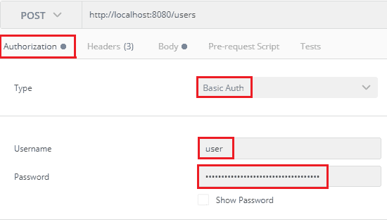
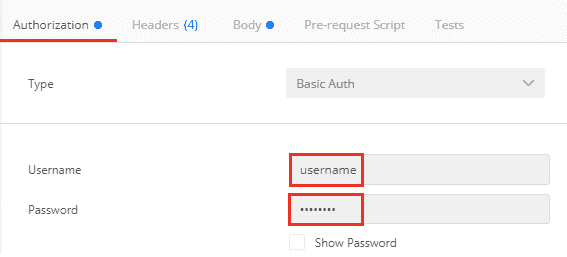

# 利用 Spring 安全性实现基本身份验证

> 原文：<https://www.javatpoint.com/restful-web-services-basic-authentication-with-spring-security>

在前面的步骤中，我们已经创建了一些资源，但是它们都不安全。没有用户 id 和密码来访问资源。在本节中，我们将实现基本身份验证。

有多种方法来验证我们的 RESTful 网络服务。基本方式是使用基本认证。在基本身份验证中，我们发送用户名和密码作为请求的一部分。当我们提供用户名和密码时，它允许我们访问资源。

还有其他高级形式的身份验证，如**摘要身份验证**，在这里创建密码摘要，并将摘要发送出去。它不会向服务器发送实际密码。另一种高级身份验证形式是 OAuth(开放授权)或 OAuth2 身份验证。

让我们看看如何在 web 服务中实现基本身份验证。

**第一步:**打开 **pom.xml** 并添加**弹簧-启动-安全**。它会自动为我们配置基本的安全性。

```java

<dependency>
<groupId>org.springframework.boot</groupId>
<artifactId>spring-boot-starter-security</artifactId>
</dependency>

```

**第二步:**重启服务器，我们在日志中得到一个**密码**。每次服务器启动时，密码都会不同。


**步骤 3:** 从日志中复制密码。

**第 4 步:**打开 REST 客户端【T2 邮递员】并发送 POST 请求。我们正在发送帖子来创建用户。

*   提供 URI http://localhost:8080/用户。
*   单击正文选项卡并选择原始单选按钮。
*   选择媒体类型 JSON(应用程序/json)。
*   提供姓名和出生日期。
*   点击发送按钮。

返回**状态:401 未授权**。


**第五步:**在 REST 客户端**邮差**中，点击**授权**标签，执行以下操作:

*   选择身份验证类型基本身份验证。
*   提供用户名。默认用户名是用户。
*   粘贴我们从日志中复制的密码。
*   点击发送按钮。



显示**状态:201 已创建**。有一个缺点是，当我们重新启动服务器时，密码会一次又一次地更改。这个问题的解决方案是在 application.properties 文件中配置用户名和密码。

**应用属性**

```java

spring.security.user.name=user
spring.security.user.password=password

```

现在，转到邮差，尝试发送一个返回**状态:401 未授权**的 POST 请求。这是因为我们仍在使用旧密码。因此，我们需要用新的用户名和密码进行更改。提供我们在属性文件中配置的用户名和密码。我们得到状态:201 已创建。



[Click here to download Implementing Basic Authentication with Spring Security project](https://static.javatpoint.com/tutorial/restful-web-services/download/Implementing Basic Authentication with Spring Security.zip)

* * *