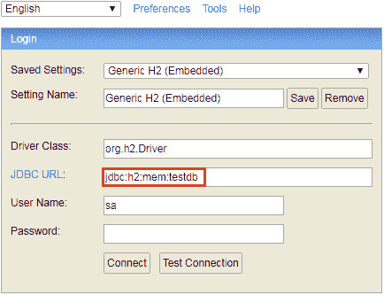

# 将 RESTful 服务连接到 JPA

> 原文：<https://www.javatpoint.com/restful-web-services-jpa>

**创建用户实体和一些测试数据**

让我们创建一个用户实体和一个用户存储库，这样我们就可以访问用户的详细信息。

**第一步:**打开 **pom.xml** 文件，添加**spring-boot-starter-data-JPA**依赖项。

```java

<dependency>
    <groupId>org.springframework.boot</groupId>
    <artifactId>spring-boot-starter-data-jpa</artifactId>
</dependency>

```

**第二步:**通过在用户类的正上方添加注释 **@Entity** ，使**用户**类成为一个实体。

**@Entity:** 实体不过是 POJO(普通旧 Java 对象)。它表示可以保存到数据库中的数据。它表示数据库中的一个表。实体的每个实例代表表中的一行。我们不能将实体类声明为**最终**。

**步骤 3:** 通过在 Id 变量的正上方添加注释@Id，使 Id 成为主键。另外，添加注释**@生成值**。

**@Id:** 定义下面的成员字段是当前实体的主键。每个实体都必须有唯一定义列的主键。

**@GeneratedValue:** 可以将@GeneratedValue 注释应用于具有 **@Id** 注释的实体的主键属性或字段。它用于支持主键。我们必须在主键属性中添加 **@GeneratedValue** 注释，并选择一个生成类型。默认的生成类型是 GenerationType.AUTO

**User.java**

```java

package com.javatpoint.server.main.user;
import java.util.Date;
import javax.persistence.Entity;
import javax.persistence.GeneratedValue;
import javax.persistence.Id;
import javax.validation.constraints.Past;
import javax.validation.constraints.Size;
import io.swagger.annotations.ApiModel;
import io.swagger.annotations.ApiModelProperty;
@ApiModel(description="All details about the user")
@Entity
public class User 
{
//making Id as primary key
@Id
@GeneratedValue
private Integer id;
@Size(min=5, message="Name should have atleast 5 characters")
@ApiModelProperty(notes="name should have atleast 5 characters")
private String name;
@Past
@ApiModelProperty(notes="Birth date should be in the past")
private Date dob;
//default constructor	
protected User()
{

}
public User(Integer id, String name, Date dob) 
{
super();
this.id = id;
this.name = name;
this.dob = dob;
}
public Integer getId() 
{
return id;
}
public void setId(Integer id) 
{
this.id = id;
}
public String getName() 
{
return name;
}
public void setName(String name) 
{
this.name = name;
}
public Date getDob() 
{
return dob;
}
public void setDob(Date dob) 
{
this.dob = dob;
}
@Override
public String toString() 
{
//return "User [id=" + id + ", name=" + name + ", dob=" + dob + "]";
return String.format("User [id=%s, name=%s, dob=%s]", id, name, dob);
}
}

```

在进入下一步之前，**删除 **pom.xml** 中的基本安全依赖项**或**注释**。

**第 4 步:**打开 **application.properties** 文件，启用 **H2 控制台**，这样我们就可以看到表中插入了哪些数据。

```java

spring.h2.console.enabled=true

```

我们还需要启用 **SQL 日志**来查看哪些 SQL 语句正在执行。当语句执行时，它开始在日志中记录 SQL。

```java

spring.jpa.show-sql=true

```

现在重新启动应用程序以获取更改。我们可以在下图中看到该表已创建。


**第五步:**我们必须创建一个 SQL 文件，在用户表中插入数据。

右键单击文件夹**src/main/resource**->New->Other->选择 SQL File - >提供文件名 **data.sql - >** 点击完成。

**第六步:**在 data.sql 文件中，将数据插入**用户**表中。我们插入了以下数据:

```java

insert into user values(1, sysdate(), 'John');
insert into user values(2, sysdate(),'Robert');
insert into user values(3, sysdate(), 'Andrew');

```

运行应用程序。

**步骤 7:** 打开浏览器，键入 http://localhost:8080/h2-console 连接 H2 控制台。确保它有 JDBC 网址: **jdbc:h2:mem:testdb** 。不要在密码字段中写任何内容。



**第八步:**点击**连接**按钮登录。我们创建的表格出现在页面的左侧。

**步骤 10:** 输入查询**从用户**中选择*；

它显示我们插入的记录表。


* * *