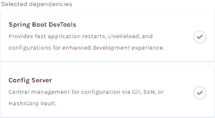
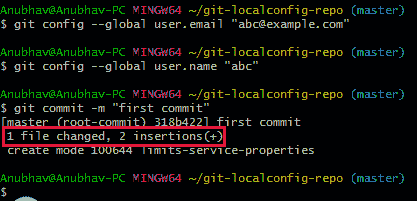

# 设置 Spring 云配置服务器

> 原文：<https://www.javatpoint.com/setting-up-spring-cloud-config-server>

**步骤 1:** 使用 Spring Initializr[https://start.spring.io/](https://start.spring.io/)创建一个 Maven 项目

**第二步:**选择 Spring Boot 版 **2.2.0 M6** 或更高版本。不要选择快照版本。

**步** **3:** 提供**团**名称。在我们的例子中，**com . javatpoint . microservice .**

**第四步:**提供**神器 id** 。我们提供了**SpringCloud 配置服务器。**


**第 5 步:**添加 **Spring Boot 开发工具**和**配置服务器**依赖项**。**



**第六步:**点击**生成项目**按钮。一个 zip 文件会下载下来，解压到硬盘里。

**第七步:**现在，打开**月食。**导入下载的 maven 项目。它将下载所需的文件。

在下一步中，我们将创建一个简单的 Git 存储库，并配置 spring cloud config 服务器从特定的 Git 存储库中获取值。我们需要安装本地 Git。

## 安装 Git 并创建本地存储库

**第一步:**从[https://git-scm.com/](https://git-scm.com/)下载 Git 并安装。

**步骤 2:** 创建一个 Git 存储库，并存储我们希望能够配置限制服务的文件。我们将尝试从 spring-cloud-config-server 访问它们。打开 Git bash 并键入以下命令:

创建新目录:

```java

mkdir git-localconfig-repo
cd git-localconfig-repo/

```

初始化新的 Git 存储库:

```java

git init

```

它初始化一个空的 git 库。

**步骤 3:** 现在转到**spring-cloud-config-server**项目，并添加一个指向特定文件夹的链接。

1.  右键单击**spring-cloud-config-server**项目**。**
2.  点击**构建路径** - > **配置构建路径** …
3.  选择**源**选项卡。
4.  点击**链接源**，浏览文件夹 **git-localconfig-repo** 。
5.  右键单击文件夹-> **新建** - > **其他** - > **文件**->T6】下一步 - >提供文件名**:限制-服务-属性** - >完成。
6.  现在在属性文件中编写以下代码:

```java

limits-service.minimum=8
limits-service.maximum=888

```

**步骤 4:** 配置用户名和用户邮箱:

```java

git config -global user.email abc@example.com
git config -global user.name "abc"

```

该命令提交我们用 git add 命令添加的任何文件，并提交我们此后更改的任何文件。

```java

git add -A

```

现在执行命令，提交存储库中的更改。它在版本历史中永久地记录或快照该文件。

```java

git commit -m "first commit"

```



我们可以看到一个文件被两个新的指令改变了。这些说明会在本地存储库中更改。

[Click here to download spring-cloud-config-server](https://static.javatpoint.com/tutorial/microservices/download/spring-cloud-config-server.zip)

* * *