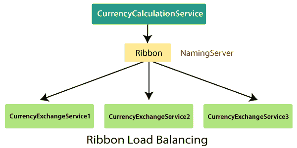

# 使用功能区进行客户端负载平衡

> 原文：<https://www.javatpoint.com/client-side-load-balancing-with-ribbon>

## 网飞丝带

网飞丝带是网飞开源软件(网飞开放源码软件)的一部分。这是一个提供**客户端负载平衡**的云库。它会自动与**网飞服务发现**(尤里卡)互动，因为它是网飞家族的成员。

功能区主要提供客户端负载平衡算法。它是一个客户端负载平衡器，提供对 **HTTP** 和 **TCP** 客户端行为的控制。重要的一点是，当我们使用 **Feign** 时，**丝带**也适用。

## 丝带的特点

*   负载平衡
*   容错
*   异步模型中的多协议支持
*   缓存和批处理

## 模块

*   **功能区:**它是一个集成了**负载平衡、容错、缓存、**和
*   **ribbon-loadbalancer:** 是一个负载均衡器 API，可以独立使用，也可以和其他模块一起使用。
*   **ribbon 尤里卡:**它使用**尤里卡**客户端，为 Spring Cloud 提供动态服务器列表。
*   **带状传输:**是支持 **HTTP、TCP、**和 **UDP** 的传输客户端，这些协议使用具有负载均衡能力的 **RxNetty** 。
*   **ribbon-httpclient:** 它是一个 REST 客户端，构建在集成了负载平衡器的 Apache HttpClient 之上。
*   **带状核:**是客户端配置 API。

## 负载平衡的类型:

负载平衡有两种类型

*   **服务器端负载均衡:**服务器端负载均衡是一个**单片**它应用于客户端和服务器之间。它接受传入的网络和应用程序流量，并通过使用各种方法在多个后端服务器之间分配流量。中间组件负责将客户端请求分发到服务器。
*   **客户端负载平衡:**客户端保存服务器的 IP 列表，这样它就可以传递请求。客户端从列表中随机选择一个 IP，并将请求转发给服务器。

让我们在项目中配置 Ribbon 服务器。

**第一步:**前往项目**货币-兑换-服务**。

**第二步:**打开 **pom.xml** 文件，添加**功能区**依赖关系**。**

```java

<dependency>
<groupId>org.springframework.cloud</groupId>
<artifactId>spring-cloud-starter-netflix-ribbon</artifactId>
</dependency>

```

添加依赖项后，我们需要在代理上启用 ribbon。

**第三步:**打开**CurrencyExchangeServiceProxy.java**文件。通过添加注释 **@RibbonClient** 启用**功能区**，并指定我们要与之对话的服务的名称。功能区客户端为客户端提供声明性配置。

```java

@RibbonClient(name="currency-exchange-service")

```

**外汇兑换服务 xy.java**

```java

package com.javatpoint.microservices.currencyconversionservice;
import org.springframework.cloud.netflix.ribbon.RibbonClient;
import org.springframework.cloud.openfeign.FeignClient;
import org.springframework.web.bind.annotation.GetMapping;
import org.springframework.web.bind.annotation.PathVariable;
//@FeignClient(name="currency-exchange-service", url="localhost:8000")
//Enabling feign
@FeignClient(name="currency-exchange-service")
//enabling ribbon
@RibbonClient(name="currency-exchange-service")
public interface CurrencyExchangeServiceProxy 
{
@GetMapping("/currency-exchange/from/{from}/to/{to}")		//where {from} and {to} are path variable
public CurrencyConversionBean retrieveExchangeValue(@PathVariable("from") String from, @PathVariable("to") String to); //from map to USD and to map to INR
}

```

**第四步:**在标注**@ feigncient 中，**去掉属性 **URL** 。因为我们不需要与某个特定的服务进行对话。我们将在**应用程序.属性**文件中配置该网址。

**第五步:**打开项目**货币兑换服务**的**应用.属性**文件，配置服务器。我们必须配置的属性是:

```java

name-of-the-application.ribbon.listOfServers=URLs

```

我们已经配置了我们想要调用的两个货币兑换服务实例。

```java

currency-exchange-service.ribbon.listOfServers=http://localhost:8000, http://localhost:8001

```

**应用属性**

```java

spring.application.name=currency-conversion-service
server.port=8100
currency-exchange-service.ribbon.listOfServers=http://localhost:8000, http://localhost:8001

```

## 使用功能区运行客户端负载平衡

我们有两个**CurrentlyExchangeServiceApplication.java 的例子，**如下图所示:


首先在端口 **8000** 上运行 currency exchangeserviceapplication，然后在端口 **8001** 上运行 currency exchangeserviceapplication。

在两个端口上运行 currency exchangeserviceapplication 后，通过发送请求[http://localhost:8100/货币转换器-feign/from/EUR/to/INR/quantity/10000](http://localhost:8100/currency-converter-feign/from/EUR/to/INR/quantity/10000)运行**CurrencyConversionServiceApplication.java**。它返回以下响应。


在上图中，端口 8000 表示货币兑换服务正在端口 8000 上运行并处理当前请求。

现在，刷新页面。除了端口号和数量之外，我们得到了相同的响应，因为我们已经更改了请求中的数量。


在上图中，端口 8001 表示货币兑换服务正在端口 8001 上运行并处理当前请求。

让我们通过一个图来了解负载平衡:



在上图中，功能区在三个活动的电流交换服务之间分配负载。 **CurrencyExchangeService1** 运行在端口 **8000、**和 **CurrencyExchangeService2** 运行在端口 **8001、**等。因此，无论使用 Ribbon 通过 CurrencyCalculationService 进行什么调用，都分布在这三个服务中。

[Click here to download currency-conversion-service](https://static.javatpoint.com/tutorial/microservices/download/ribbon/currency-conversion-service.zip)
[Click here to download currency-exchange-service](https://static.javatpoint.com/tutorial/microservices/download/ribbon/currency-exchange-service.zip)

* * *