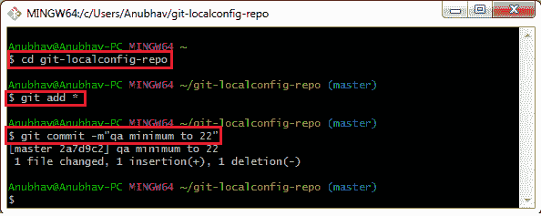

# 了解对 SpringCloud 总线的需求

> 原文：<https://www.javatpoint.com/understanding-the-need-for-spring-cloud-bus>

**第一步:**选择项目**spring-cloud-config-server**，运行**SpringCloudConfigServerApplication.java**文件。

**步骤 2:** 选择项目**限额-服务**并运行**LimitsServiceApplication.java**文件。

**第三步:**打开浏览器，输入[https://localhost/8080/limits](https://localhost/8080/limits)。它返回以下响应:

```java
{"maximum":222,"minimum":2}

```

我们从**限制-服务-质量保证.属性**文件中获取这些值，因为我们已经将该文件配置到了**限制-服务**的**引导.属性**文件中。

下一步，我们将再创建一个**limitesserviceapplication 的实例。**

**步骤 4:** 创建一个**限制服务应用程序的实例。**

右键单击**限制-服务**项目- >运行方式- >运行配置……->右键单击**限制服务应用程序** - >复制- >将应用程序名称重命名为**限制服务应用程序 8081** - >单击**参数**选项卡- >提供虚拟机参数: **-Dserver.port=8081** -


LimitsServiceApplication 的一个实例将在端口 **8081** 上运行。

**第五步:**打开浏览器，调用[网址 http://locahost:8081/limits](http://locahost:8081/limits) 。它返回与原始限制服务发送的响应相同的响应。

```java
{"maximum":222,"minimum":2}

```

限制的两个实例-服务启动和运行。

**步骤 6:** 在**限制-服务-质量保证属性中进行更改，**我们已经将最小值从 **2** 更改为 **22** 。

**限制-服务-质量保证属性**

```java
limits-service.minimum=22
limits-service.maximum=222

```

我们需要**提交**变更。

**第 7 步:**打开 **Git Bash** 并运行以下命令:

```java
$ cd git-localconfig-repo
$ git add *
$ git commit –m "qa minimum to 22"

```



再次调用网址[http://localhost:8080/limits](http://localhost:8080/limits)和[http://localhost:8081/limits](http://localhost:8081/limits)。两个 URL 都返回旧值，而我们已经在 Git 存储库中提交了这些值。它不反映**限制服务**中的值。要更改限额服务，我们将使用**邮递员。**

#### 注意:在进入下一步之前，从限额服务中移除证券。

**步骤 8:** 使用以下语句打开**限制服务属性**文件并禁用**安全**。

```java
management.security.enabled=false

```

再次，在**限制-服务-质量保证.属性**文件中设置旧值并提交更改。

**第九步:**打开**邮差**，发送 **POST** 请求，网址[http://localhost:8080/应用/刷新](http://localhost:8080/application/refresh)。

#### 注意:如果你调用的是 URL http://localhost:8080/limits，它不返回新值。因此，要获取调用 URL http://localhost:8081/limits 时的新值，您必须执行以下操作:
打开 Postman 并发送一个带有 URL http://localhost:8081/application/refresh 的 POST 请求。

**第十步:**调用[http://localhost:8080/limites](http://localhost:8080/limits)和[http://localhost:8081/limites](http://localhost:8081/limits)。现在这两个网址都返回改变后的值。

```java
{"maximum":222,"minimum":22}

```

我们已经创建了极限服务的两个实例。假设有 100 个极限实例——并行运行的服务。我们需要调用一百个 URL 来刷新 Git 存储库中的配置。

调用一百个网址并不像限制服务的数量增加那么容易。与此同时，服务的维护问题也越来越严重。

每当我们对配置进行更改时，它必须反映微服务的更改。这里**SpringCloud 总线**对此提供了解决方案，所以我们不需要调用百个 URL。

Spring Cloud Bus 为所有的 100 个实例提供了一个 URL。当我们调用该 URL 时，微服务的所有实例都将使用 Git 配置中的最新值进行更新。

下一步，我们将实现 SpringCloud 总线。

[Click here to download limits-service](https://static.javatpoint.com/tutorial/microservices/download/bus/limits-service.zip)
[Click here to download spring-cloud-config-server](https://static.javatpoint.com/tutorial/microservices/download/bus/spring-cloud-config-server.zip)

* * *