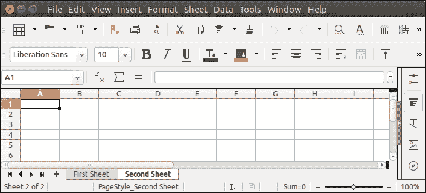

# ApachePOI 工作簿表单

> 原文：<https://www.javatpoint.com/apache-poi-excel-workbook>

为了在 excel 中创建工作表，POI 提供了一种方法 **createSheet()** ，每次调用函数时都会创建一个新的工作表。创建工作表时，请考虑以下几点。

*   名称不得超过 31 个字符。
*   不得包含以下任何字符(0x0000、0x0003、冒号(:)、反斜杠(\)、星号(*)、问号(？)，正斜杠(/)，左方括号([)，右方括号(]))。

让我们看一个例子，在这个例子中，我们使用 createSheet()方法来创建两个独立的工作表。

## ApachePOI 工作簿工作表示例

```java

package poiexample;
import java.io.FileNotFoundException;
import java.io.FileOutputStream;
import java.io.IOException;
import java.io.OutputStream;
import org.apache.poi.hssf.usermodel.HSSFWorkbook;
import org.apache.poi.ss.usermodel.Sheet;
import org.apache.poi.ss.usermodel.Workbook;
public class NewSheet {
	public static void main(String[] args) throws FileNotFoundException, IOException {
		Workbook wb = new HSSFWorkbook();
	    try  (OutputStream fileOut = new FileOutputStream("Javatpoint.xls")) {
	        Sheet sheet1 = wb.createSheet("First Sheet");
	        Sheet sheet2 = wb.createSheet("Second Sheet");
	        wb.write(fileOut);
	    }catch(Exception e) {
	    	System.out.println(e.getMessage());
	    }
	}
}

```

**输出:**

```java
See at bottom of the file, two sheets are created First Sheet, Second Sheet.

```

