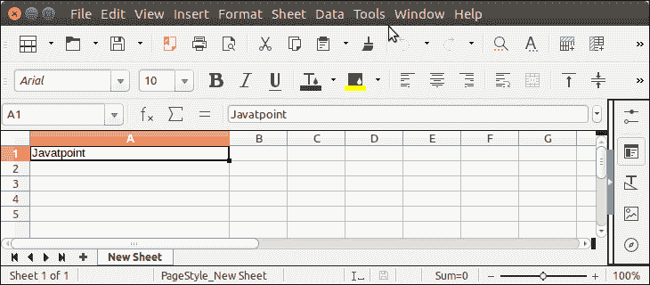

# ApachePOI Excel 对齐单元格

> 原文：<https://www.javatpoint.com/apache-poi-excel-align-cell>

Apache POI 有助于以某种方式对齐单元格及其内容。我们可以设置单元格的高度和宽度&上下对齐。Sheet 类提供了设置高度和宽度的方法。

让我们看一个例子，我们正在创建一个单元格，并将其对齐。

## ApachePOI Excel 对齐单元格示例

```java

package poiexample;
import java.io.FileNotFoundException;
import java.io.FileOutputStream;
import java.io.IOException;
import java.io.OutputStream;
import java.util.Date;
import org.apache.poi.hssf.usermodel.HSSFCellStyle;
import org.apache.poi.hssf.usermodel.HSSFWorkbook;
import org.apache.poi.ss.usermodel.VerticalAlignment;
import org.apache.poi.ss.usermodel.Cell;
import org.apache.poi.ss.usermodel.CellStyle;
import org.apache.poi.ss.usermodel.CreationHelper;
import org.apache.poi.ss.usermodel.HorizontalAlignment;
import org.apache.poi.ss.usermodel.Row;
import org.apache.poi.ss.usermodel.Sheet;
import org.apache.poi.ss.usermodel.Workbook;
import org.apache.poi.xssf.usermodel.XSSFCell;
import org.apache.poi.xssf.usermodel.XSSFCellStyle;

public class AlignExample {
	public static void main(String[] args) throws FileNotFoundException, IOException {
		Workbook wb = new HSSFWorkbook();
	    try  (OutputStream os = new FileOutputStream("Javatpoint.xls")) {
	        Sheet sheet = wb.createSheet("New Sheet");
	        Row row = sheet.createRow(0);
	        Cell cell = row.createCell(0);
	        cell.setCellValue("Javatpoint");
	        CellStyle cellStyle = wb.createCellStyle();
	        row = sheet.createRow(5); 
	        cell = row.createCell(0);
	        // Top Left alignment 
	        HSSFCellStyle style1 = (HSSFCellStyle) wb.createCellStyle();
	        sheet.setColumnWidth(0, 8000);
	        cell.setCellValue("Top Left");
	        cell.setCellStyle(style1);
	        row = sheet.createRow(6); 
	        cell = row.createCell(1);
	        row.setHeight((short) 800);
	        wb.write(os);
	    }catch(Exception e) {
	    	System.out.println(e.getMessage());
	    }
	}

}

```

**输出:**

