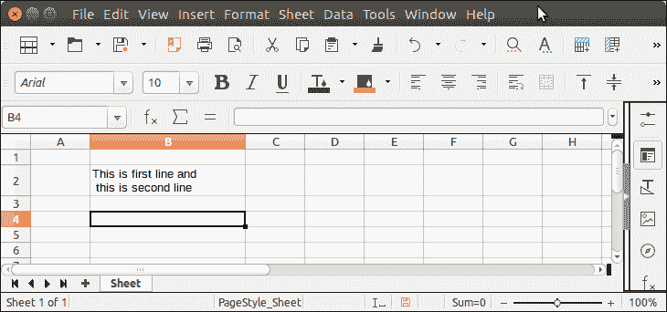

# 《细胞》中的 Apache POI Newline

> 原文：<https://www.javatpoint.com/apache-poi-newline-in-cell>

为了将多行数据写入单元格，Apache POI 提供了处理它的方法。让我们看一个例子，在这个例子中，我们已经将多行数据存储到了一个单元格中。

## 单元格示例中的 Apache POI 换行符

```java

package poiexample;
import java.io.FileOutputStream;
import java.io.OutputStream;
import org.apache.poi.hssf.usermodel.HSSFWorkbook;
import org.apache.poi.ss.usermodel.Cell;
import org.apache.poi.ss.usermodel.CellStyle;
import org.apache.poi.ss.usermodel.Row;
import org.apache.poi.ss.usermodel.Sheet;
import org.apache.poi.ss.usermodel.Workbook;
public class NewlineExample {
	public static void main(String[] args) {
		try (OutputStream fileOut = new FileOutputStream("Javatpoint.xls")) {
			Workbook wb = new HSSFWorkbook();
			Sheet sheet = wb.createSheet("Sheet");
			Row row     = sheet.createRow(1);
			Cell cell   = row.createCell(1);
			cell.setCellValue("This is first line and \n this is second line");
			CellStyle cs = wb.createCellStyle();
			cs.setWrapText(true);
			cell.setCellStyle(cs);
			row.setHeightInPoints((2*sheet.getDefaultRowHeightInPoints()));
			sheet.autoSizeColumn(2);
	        wb.write(fileOut);
	    }catch(Exception e) {
	    	System.out.println(e.getMessage());
	    }
	}
}

```

**输出:**

