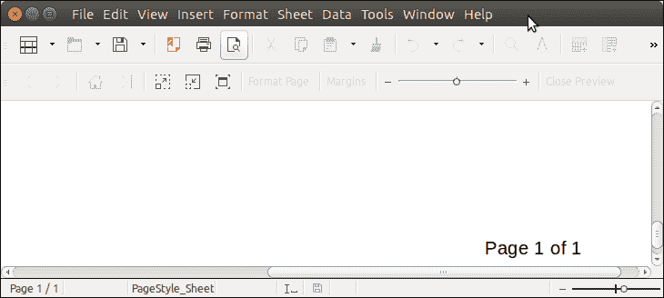

# ApachePOI 页码

> 原文：<https://www.javatpoint.com/apache-poi-page-number>

Apache POI 允许我们在表尾设置页码。要设置页码 **getFooter()** 方法创建页脚，page()和 numPages()都用于设置页码。

在下面的例子中，我们首先创建了一个页脚，然后给它添加了页码。

## ApachePOI 页码示例

```java

package poiexample;
import java.io.FileOutputStream;
import java.io.OutputStream;
import org.apache.poi.hssf.usermodel.HSSFWorkbook;
import org.apache.poi.hssf.usermodel.HeaderFooter;
import org.apache.poi.ss.usermodel.Footer;
import org.apache.poi.ss.usermodel.Sheet;
import org.apache.poi.ss.usermodel.Workbook;
public class PageNoExample {
	public static void main(String[] args) {		
		try (OutputStream os = new FileOutputStream("Javatpoint.xls")) {
			Workbook wb = new HSSFWorkbook();
		    Sheet sheet = wb.createSheet("Sheet");
		    Footer footer = sheet.getFooter();
		    footer.setRight( "Page " + HeaderFooter.page() + " of " + HeaderFooter.numPages() );
	        wb.write(os);
		 }catch(Exception e) {
		    System.out.println(e.getMessage());
		 }
      }
}

```

**输出:**

