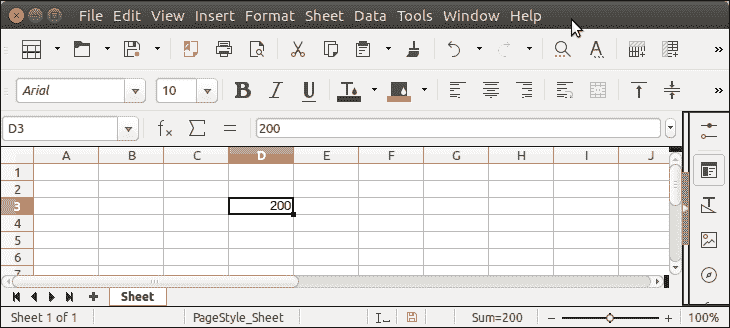

# ApachePOI 阅读单元格内容

> 原文：<https://www.javatpoint.com/apache-poi-reading-cell-content>

## ApachePOI 阅读单元格内容示例

```java

package poiexample;
import java.io.FileInputStream;
import java.io.InputStream;
import org.apache.poi.ss.usermodel.Cell;
import org.apache.poi.ss.usermodel.Row;
import org.apache.poi.ss.usermodel.Sheet;
import org.apache.poi.ss.usermodel.Workbook;
import org.apache.poi.ss.usermodel.WorkbookFactory;
public class GettingCellContentExample {
	public static void main(String[] args) {
		try (InputStream inp = new FileInputStream("Javatpoint.xls")) {
		        Workbook wb = WorkbookFactory.create(inp);
		        Sheet sheet = wb.getSheetAt(0);
		        Row row = sheet.getRow(2);
		        Cell cell = row.getCell(3);
		        if (cell != null)
		        	System.out.println("Data: "+cell);
		        else
		            System.out.println("Cell is empty");
	    }catch(Exception e) {
	    	System.out.println(e);
	    }
	}
}

```

这是我们想要阅读的电子表格文件。



执行上述示例后，它从指定的单元格中读取值，并向控制台输出以下内容。

**输出:**

```java
Data: 200.0

```