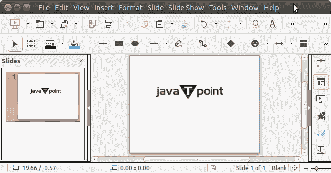

# Apache 然后 Powerpoint 映像

> 原文：<https://www.javatpoint.com/apache-poi-powerpoint-image>

要在 powerpoint 幻灯片中设置图像，我们可以使用 POI API 的 addPicture()和 createPicture()方法。在下面的示例中，我们使用了这两种方法在文档中写入图像。

## ApachePOI 侧面图像示例

```java

package poiexample;
import java.io.FileInputStream;
import java.io.FileNotFoundException;
import java.io.FileOutputStream;
import java.io.IOException;
import java.io.OutputStream;
import org.apache.poi.util.IOUtils;
import org.apache.poi.xslf.usermodel.XMLSlideShow;
import org.apache.poi.xslf.usermodel.XSLFPictureData;
import org.apache.poi.xslf.usermodel.XSLFPictureShape;
import org.apache.poi.xslf.usermodel.XSLFSlide;
public class ReOrderSlidesExample {
	public static void main(String[] args) throws FileNotFoundException, IOException {
		XMLSlideShow ppt = new XMLSlideShow();
	    try (OutputStream os = new FileOutputStream("Javatpoint.pptx")) {	
		    XSLFSlide slide = ppt.createSlide();
		    byte[] pictureData = IOUtils.toByteArray(new FileInputStream("jtp.png"));
		    XSLFPictureData pd = ppt.addPicture(pictureData, XSLFPictureData.PictureType.PNG);
		    XSLFPictureShape pic = slide.createPicture(pd);
		    ppt.write(os);
	    }catch(Exception e) {
	    	System.out.println(e);
	    }
	}
}

```

**输出:**

