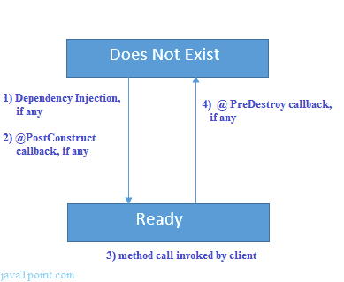

# 无状态会话 Bean

> 原文：<https://www.javatpoint.com/stateless-session-bean>

**无状态会话 bean** *是一个业务对象，只表示业务逻辑*。它没有状态(数据)。

换句话说，在无状态会话 bean 的情况下，容器不维护多个方法调用之间的*会话状态*。

EJB 容器将无状态 bean 对象汇集在一起，按需为请求提供服务。

一次只能由一个客户端访问。在并发访问的情况下，EJB 容器将每个请求路由到不同的实例。

* * *

## 无状态会话 Bean 中使用的注释

无状态会话 bean 中使用了 3 个重要的注释:

1.  @无状态
2.  @PostConstruct
3.  @PreDestroy

* * *

## 无状态会话 Bean 的生命周期

无状态会话 bean 只有两种状态:不存在和就绪。由下图解释。



EJB 容器首先创建并维护一个会话 bean 池。如果有，它会注入依赖关系，然后调用@PostConstruct 方法。现在，客户端调用实际的业务逻辑方法。然后，容器调用@PreDestory 方法(如果有)。现在 bean 已经准备好进行垃圾收集了。

* * *

## 无状态会话 Bean 的示例

为了开发无状态 bean 应用程序，我们将使用 **Eclipse IDE** 和 **glassfish 3** 服务器。

要创建 EJB 应用程序，您需要创建 bean 组件和 bean 客户端。

#### 1)创建无状态 bean 组件

要创建无状态 bean 组件，您需要创建一个远程接口和一个 bean 类。

File: AdderImplRemote.java

```java
package com.javatpoint;
import javax.ejb.Remote;

@Remote
public interface AdderImplRemote {
int add(int a,int b);
}

```

File: AdderImpl.java

```java
package com.javatpoint;
import javax.ejb.Stateless;

@Stateless(mappedName="st1")
public class AdderImpl implements AdderImplRemote {
  public int add(int a,int b){
	  return a+b;
  }
}

```

* * *

#### 2)创建无状态 bean 客户端

无状态 bean 客户端可以是本地、远程或 webservice 客户端。在这里，我们将创建远程客户端。它是基于控制台的应用程序。这里，我们不使用依赖注入。依赖注入只能用于基于 web 的客户端。

File: AdderImpl.java

```java
package com.javatpoint;
import javax.naming.Context;
import javax.naming.InitialContext;

public class Test {
public static void main(String[] args)throws Exception {
	Context context=new InitialContext();
	AdderImplRemote remote=(AdderImplRemote)context.lookup("st1");
	System.out.println(remote.add(32,32));
}
}

```

#### 输出

```java
Output: 64

```