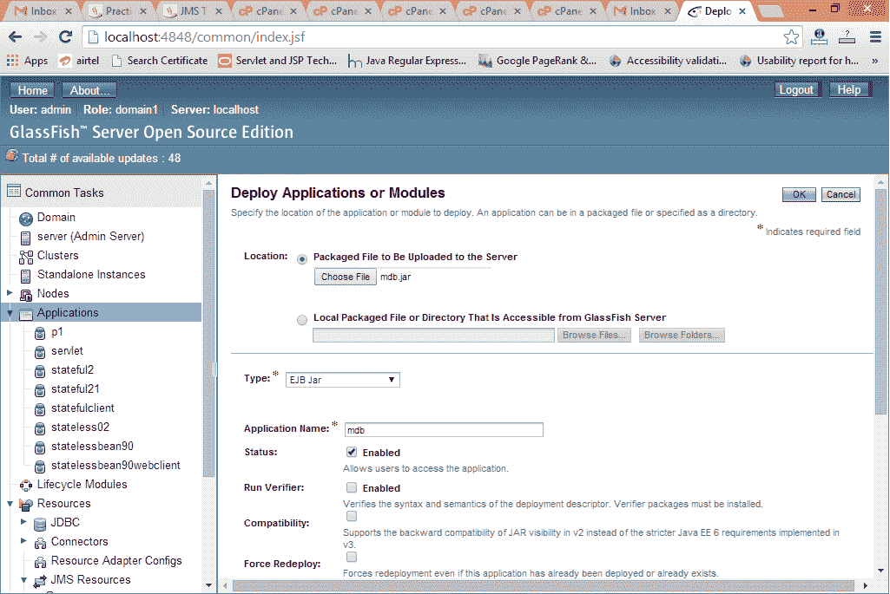
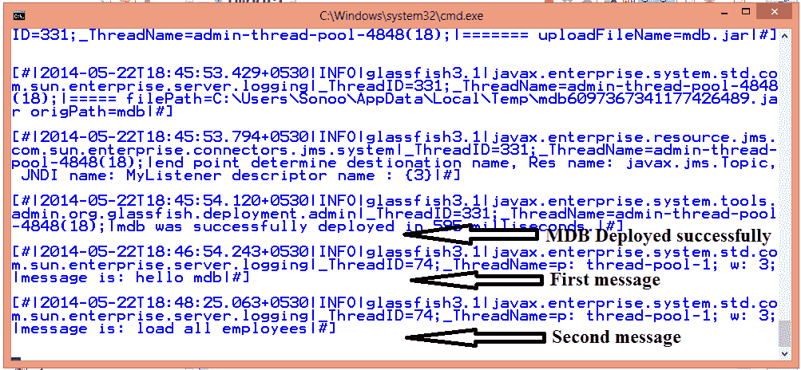

# 消息驱动 Bean

> 原文：<https://www.javatpoint.com/message-driven-bean>

消息驱动 bean (MDB)是一个包含业务逻辑的 bean。但是，它是通过传递消息来调用的。所以，它就像 JMS 接收器。

MDB 异步接收消息并处理它。

消息驱动 bean 从队列或主题接收消息，因此您必须了解 JMS API。

消息驱动 bean 就像无状态会话 bean，封装了业务逻辑，不维护状态。


* * *

## 消息驱动 Bean 示例

要创建消息驱动 bean，需要声明@MessageDriven 注释并实现 MessageListener 接口。

在 eclipse ide 中，创建 **EJB 项目**，然后创建一个如下所示的类:

File: MyListener.java

```java
package com.javatpoint;
import javax.ejb.MessageDriven;
import javax.jms.*;

@MessageDriven(mappedName="myTopic")
public class MyListener implements MessageListener{
	@Override
	public void onMessage(Message msg) {
		TextMessage m=(TextMessage)msg;
		try{
		System.out.println("message received: "+m.getText());
		}catch(Exception e){System.out.println(e);}
	}
}

```

导出 ejb 项目并部署应用程序。

在 **glassfish 服务器**中，点击**应用程序** - > **部署** - >通过**选择文件** - > **确定**选择 mdb jar 文件。



现在**使用上一页中介绍的 JMS** 发送消息。

