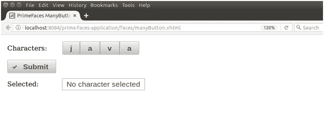
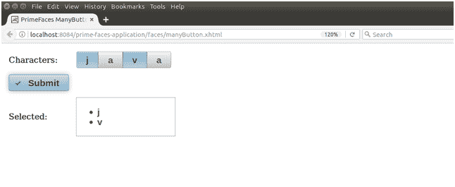

# PrimeFaces 选择多个按钮

> 原文：<https://www.javatpoint.com/primefaces-selectmanybutton>

这是一个使用按钮用户界面的多选组件。**<p:selectmany button>**组件用于创建多个按钮。它用于通过使用按钮获得用户输入。我们可以在 JSF 应用程序中创建它。下面列出了它的各种属性。

## 许多按钮属性

| 属性 | 缺省值 | 返回类型 | 描述 |
| 编号 | 空 | 线 | 它是组件的唯一标识符。 |
| 提供 | 真实的 | 布尔代数学体系的 | 它用于渲染组件。它需要布尔值。 |
| 有约束力的 | 空 | 对象 | 它用于设置映射到支持 bean 中的服务器端 UIComponent 实例的表达式 |
| 价值 | 空 | 对象 | 它用于设置引用列表的组件的值。 |
| 转换器 | 空 | 转换器/字符串 | 它用于设置定义组件转换器的文本。 |
| 需要 | 错误的 | 布尔代数学体系的 | 它用于根据需要制造组件 |
| widgetVar | 空 | 线 | 这是客户端小部件的名称。 |
| 有缺陷的 | 错误的 | 布尔代数学体系的 | 它用于禁用组件。 |
| 标签 | 空 | 线 | 它用于设置用户可表示的名称。 |
| 昂哥 | 空 | 线 | 它用于在值更改时执行脚本。 |
| 风格 | 空 | 线 | 用于设置组件的内联 CSS。 |

* * *

## 例子

在下面的例子中，我们实现了**<p:selectmany button>**组件。本示例包含以下文件。

### JSF 档案

**// manyButton.xhtml**

```java

<?xml version='1.0' encoding='UTF-8' ?>
<!DOCTYPE html PUBLIC "-//W3C//DTD XHTML 1.0 Transitional//EN""http://www.w3.org/TR/xhtml1/DTD/xhtml1-transitional.dtd">
<html 
xmlns:h="http://xmlns.jcp.org/jsf/html"
xmlns:p="http://primefaces.org/ui"
xmlns:f="http://xmlns.jcp.org/jsf/core">
<h:head>
<title>PrimeFaces ManyButton</title>
</h:head>
<h:body>
<h:form>
<h:panelGrid columns="2" style="margin-bottom:10px" cellpadding="5">
<h:outputText value="Characters:" />
<p:selectManyButton value="#{manyButton.selectedValue}">
<f:selectItem itemLabel="j" itemValue="j" />
<f:selectItem itemLabel="a" itemValue="a" />
<f:selectItem itemLabel="v" itemValue="v" />
<f:selectItem itemLabel="a" itemValue="a" />
</p:selectManyButton>
<p:commandButton value="Submit" update="bol" icon="ui-icon-check" />
<p:spacer />
<h:outputText value="Selected:" />
<p:dataList id="bol" value="#{manyButton.selectedValue}" var="character" emptyMessage="No character selected">
<h:outputText value="#{character}" style="font-weight: bold" />
</p:dataList>
</h:panelGrid>
</h:form>
</h:body>
</html>

```

### ManagedBean

**//ManyButton.java**

```java

package com.javatpoint;
import java.util.List;
import javax.faces.bean.ManagedBean;
@ManagedBean
public class ManyButton {
private List<String> selectedValue;
public List<String> getSelectedValue() {
return selectedValue;
}
public void setSelectedValue(List<String> selectedValue) {
this.selectedValue = selectedValue;
}
}

```

输出:

 