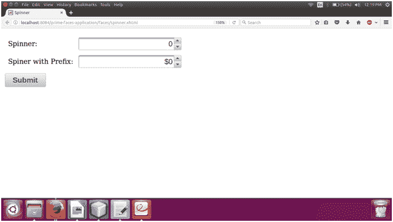
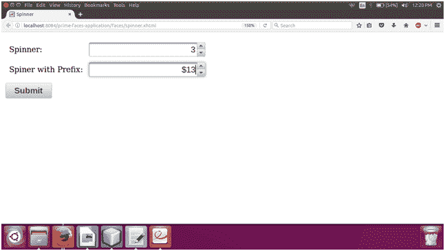

# 质数面微调器

> 原文：<https://www.javatpoint.com/primefaces-spinner>

它是一个输入文本，提供增量和减量按钮。它用于在输入文本中获取用户输入。我们可以在我们的 JSF 应用程序中使用 **< p:spinner >** 组件来创建它。下面列出了它的各种属性。

## 微调属性

| 属性 | 缺省值 | 类型 | 描述 |
| 编号 | 空 | 线 | 它是组件的唯一标识符。 |
| 提供 | 真实的 | 布尔代数学体系的 | 它用于指定组件的呈现。 |
| 价值 | 空 | 目标 | 它用于设置组件的值。 |
| 需要 | 错误的 | 布尔代数学体系的 | 它用于根据需要标记组件。 |
| widgetVar | 空 | MethodExpr | 它用于设置客户端小部件的名称。 |
| 步长因子 | one | 两倍 | 它是每个增量和减量的步进因子。 |
| 部 | 空 | 两倍 | 它设置最小边界值。 |
| 最大 | 空 | 两倍 | 它设置最大边界值。 |
| 前缀 | 空 | 线 | 用于设置输入的前缀。 |
| 后缀 | 空 | 线 | 用于设置输入的后缀。 |
| 访问密钥 | 空 | 线 | 它是一个访问键，按下时会将焦点转移到输入元素。 |
| 最大长度 | 空 | 整数 | 它用于设置该字段中可以输入的最大字符数。 |
| onselect | 空 | 线 | 当用户选择输入元素中的文本时，它执行脚本。 |
| 占位符 | 空 | 线 | 它指定了一个简短的提示。 |
| 大小 | 空 | 整数 | 它设置用于确定输入元素宽度的字符数。 |

## 例子

在下面的例子中，我们实现了 **< p:spinner >** 组件。本示例包含以下文件。

### JSF 档案

**// spinner.xhtml**

```java

<?xml version='1.0' encoding='UTF-8' ?>
<!DOCTYPE html PUBLIC "-//W3C//DTD XHTML 1.0 Transitional//EN""http://www.w3.org/TR/xhtml1/DTD/xhtml1-transitional.dtd">
<html 
xmlns:h="http://xmlns.jcp.org/jsf/html"
xmlns:p="http://primefaces.org/ui">
<h:head>
<title>Spinner</title>
</h:head>
<h:body>
<h:form>
<h:panelGrid columns="2" cellpadding="5" styleClass="ui-grid">
<h:outputLabel value="Spinner: " />
<p:spinner value="#{spinner.value1}" />
<h:outputLabel for="prefix" value="Spiner with Prefix: " />
<p:spinner id="prefix" value="#{spinner.value2}" prefix="$" min="0" />
</h:panelGrid>
<p:commandButton value="Submit" oncomplete="PF('dlg').show()" />
</h:form>
</h:body>
</html>

```

### ManagedBean

**//Spinner.java**

```java

package com.javatpoint;
import javax.faces.bean.ManagedBean;
@ManagedBean
public class Spinner {
private int value1;
private int value2;
public int getValue1() {
return value1;
}
public void setValue1(int value1) {
this.value1 = value1;
}
public int getValue2() {
return value2;
}
public void setValue2(int value2) {
this.value2 = value2;
}
}

```

输出:


