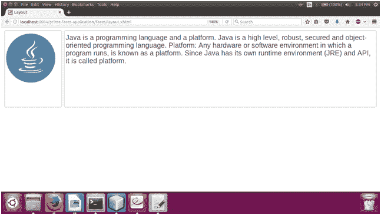

# PrimeFace 布局

> 原文：<https://www.javatpoint.com/primefaces-layout>

这是一个高度可定制的边界布局模型。即使我们不熟悉网页设计，也很容易创建复杂的布局。它由 5 个不同的布局单元组成，分别是顶部、左侧、中间、右侧和底部。我们可以称之为东、西、北、南、中。

PrimeFaces 提供了 **< p:layout >** 组件，用于在 JSF 应用中布局我们的页面。

## 布局属性

| 属性 | 缺省值 | 类型 | 描述 |
| 提供 | 真实的 | 布尔代数学体系的 | 它使用布尔值来指定组件的呈现。 |
| 全页 | 错误的 | 布尔代数学体系的 | 它指定布局是否应该跨越整个页面。 |
| 风格 | 空 | 线 | 它用于设置要应用于容器元素的样式。 |
| onResize | 空 | 线 | 它在调整布局单元大小时执行。 |
| 无糖的 | 空 | 线 | 它在布局单元关闭时执行。 |
| on 切换 | 空 | 线 | 它在切换布局单元时执行。 |
| 调整标题大小 | 空 | 线 | 用于设置调整大小按钮的标题标签。 |
| collapseTitle | 空 | 线 | 用于设置折叠按钮的标题标签。 |
| expandTitle | 空 | 线 | 用于设置展开按钮的标题标签。 |
| closeritle | 空 | 线 | 用于设置关闭按钮的标题标签。 |

## 例子

这里，在下面的例子中，我们正在实现 **< p:布局>** 组件。本示例包含以下文件。

### JSF 档案

**// layout.xhtml**

```java
<?xml version='1.0' encoding='UTF-8' ?>
<!DOCTYPE html PUBLIC "-//W3C//DTD XHTML 1.0 Transitional//EN""http://www.w3.org/TR/xhtml1/DTD/xhtml1-transitional.dtd">
<html 
xmlns:h="http://xmlns.jcp.org/jsf/html"
xmlns:p="http://primefaces.org/ui">
<h:head>
<title>Layout</title>
</h:head>
<h:body>
<p:layout style="min-width:400px;min-height:200px;">
<p:layoutUnit position="west" resizable="true" size="150" minSize="40" maxSize="200">
<p:graphicImage name="images/courses/java.png" />
</p:layoutUnit>
<p:layoutUnit position="center">
<h:outputText value="Java is a programming language and a platform.
Java is a high level, robust, secured and object-oriented programming language.
Platform: Any hardware or software environment in which a program runs, is known as a platform. 
Since Java has its own runtime environment (JRE) and API, it is called platform."/>
</p:layoutUnit>
</p:layout>
</h:body>
</html>

```

输出:

