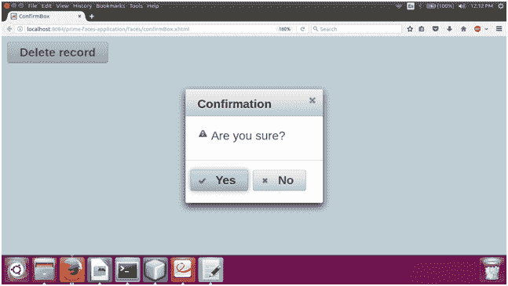

# primefaces confirmdialog 确认对话方块

> 哎哎哎:# t0]https://www . javatppoint . com/primitives-confirm dialog

它是 JavaScript 确认框的高级版本。它包括各种功能，如:皮肤，定制和避免弹出窗口拦截器。它用于创建确认对话框以获得用户响应。

**< p:确认>** 组件用于在 JSF 应用程序中创建确认对话框。下面列出了它的各种属性。

## 确认对话框属性

| 属性 | 缺省值 | 类型 | 描述 |
| 编号 | 空 | 线 | 它是组件的唯一标识符。 |
| 消息 | 空 | 线 | 用于设置正文中显示的文本。 |
| 页眉 | 空 | 线 | 它用于设置标题的文本。 |
| 严重 | 空 | 线 | 它用于为显示的图标设置消息严重性。 |
| 宽度 | 汽车 | 整数 | 它用于以像素为单位设置对话框的宽度。 |
| 高度 | 汽车 | 整数 | 它用于以像素为单位设置对话框的宽度。 |
| 风格 | 空 | 线 | 用于设置对话框容器的内嵌 CSS。 |
| 可关闭的 | 真实的 | 布尔代数学体系的 | 用于定义是否显示关闭图标。 |
| 挂了 | 空 | 线 | 它用于将对话框附加到由给定搜索表达式定义的元素。 |
| 看得见的 | 错误的 | 布尔代数学体系的 | 是否在加载时显示确认对话框。 |
| 全球的 | 错误的 | 布尔代数学体系的 | 启用后，确认对话框将成为需要确认的其他组件的共享对话框。 |
| 应答的 | 错误的 | 布尔代数学体系的 | 在响应模式下，对话框会根据屏幕宽度自行调整。 |

## 例子

在下面的例子中，我们实现了 **< p:confirmDialog >** 组件。本示例包含以下文件。

### JSF 档案

**//确认对话. xhtml**

```java

<?xml version='1.0' encoding='UTF-8' ?>
<!DOCTYPE html PUBLIC "-//W3C//DTD XHTML 1.0 Transitional//EN""http://www.w3.org/TR/xhtml1/DTD/xhtml1-transitional.dtd">
<html 
xmlns:h="http://xmlns.jcp.org/jsf/html"
xmlns:p="http://primefaces.org/ui">
<h:head>
<title>ConfirmBox</title>
</h:head>
<h:body>
<h:form>
<p:growl id="message" showDetail="true" />
<p:commandButton value="Delete record" actionListener="#{confirmBox.confirm}" update="message">
<p:confirm header="Confirmation" message="Are you sure?" icon="ui-icon-alert" />
</p:commandButton>
<p:confirmDialog global="true" showEffect="fade" hideEffect="fade">
<p:commandButton value="Yes" type="button" styleClass="ui-confirmdialog-yes" icon="ui-icon-check" />
<p:commandButton value="No" type="button" styleClass="ui-confirmdialog-no" icon="ui-icon-close" />
</p:confirmDialog>
</h:form>
</h:body>
</html>

```

### ManagedBean

**// ConfirmBox.java**

```java

package com.javatpoint;
import javax.faces.application.FacesMessage;
import javax.faces.bean.ManagedBean;
import javax.faces.context.FacesContext;
@ManagedBean
public class ConfirmBox {
public void confirm() {
addMessage("Delete record","Record has been deleted.");
}
public void addMessage(String summary, String detail) {
FacesMessage message = new FacesMessage(FacesMessage.SEVERITY_INFO, summary, detail);
FacesContext.getCurrentInstance().addMessage(null, message);
}
}

```

输出:


