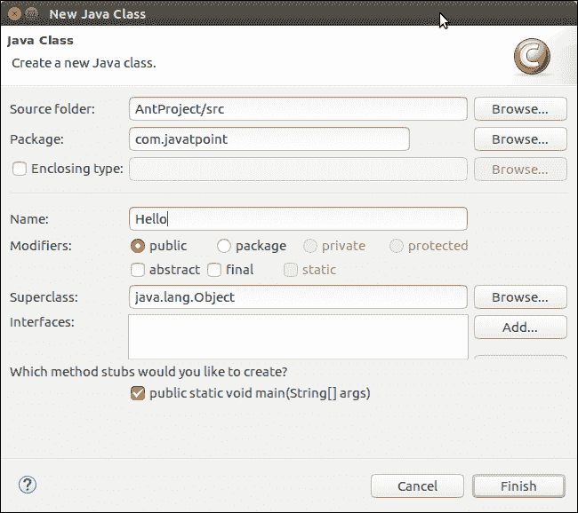
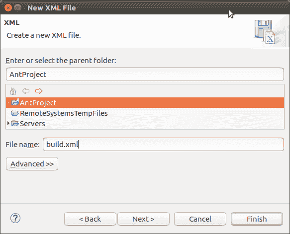
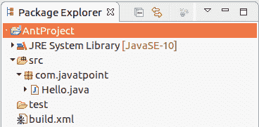
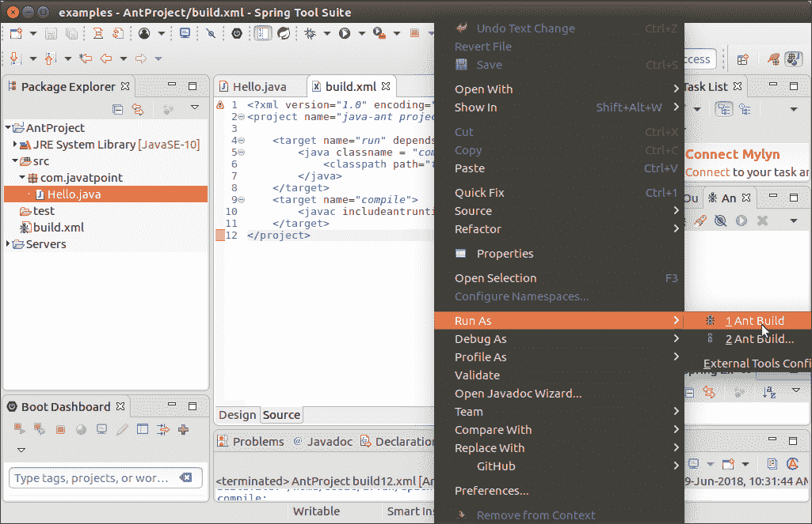

# ApacheAnt 你好世界

> 原文：<https://www.javatpoint.com/apache-ant-hello-world>

为了创建一个简单的 hello world 项目，我们使用了 [Eclipse IDE](creating-jsp-in-eclipse-ide) ，该项目需要以下步骤。

1.  创建一个 Java 项目
2.  创建一个 Java 文件
3.  创建一个可扩展标记语言文件
4.  创建文件夹
5.  运行为 Ant 构建

### Java 项目

从文件菜单中选择 [Java 项目](java-application-world-project)创建一个项目，并提供其名称。


### Java 文件

通过提供名称**你好**来创建一个 [Java 类](java-arraylist)，参见下面的例子。



### XML 文件

通过提供名称**构建**来创建一个 [XML](xml-tutorial) 文件。构建是一个默认名称，但是我们也可以设置其他名称。



### 创建文件夹

创建一个文件夹来组织编译后的 [Java](java-tutorial) 类文件。这个文件夹可以是任何东西，这里我们已经创建了一个**测试**文件夹。

### 项目结构

创建完以上所有文件后，我们的项目应该如下图所示。



在这个项目中， [Java](history-of-java) 和 [XML](features-and-advantages-of-xml) 文件包含下面的代码来显示 **Hello World** 消息。

**//Hello.Java**

```java

package com.javatpoint;
public class Hello {
	public static void main(String[] args) {
		System.out.println("Hello Javatpoint");
	}
}

```

**// build.xml**

```java

<?xml version="1.0" encoding="UTF-8"?>
<project name="java-ant project" default="run">
	<target name="run" depends="compile">
		<java classname = "com.javatpoint.Hello">
			<classpath path="test"></classpath>
		</java>
	</target>
	<target name="compile">
		<javac includeantruntime="false" srcdir="./src" destdir = "test"></javac>
	</target>
</project>

```

### 运行项目

要运行项目，右键单击 **build.xml** 文件，选择**运行方式→Ant 构建**。运行之后，它以特定的格式显示输出，请参见下面的。



**输出:**

