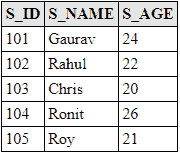
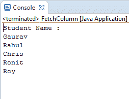
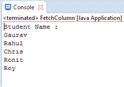

# 基本操作

> 原文：<https://www.javatpoint.com/jpa-jpql-basic-operations>

JPQL 允许我们创建静态和动态查询。现在，我们将在下表中使用这两种类型的查询来执行一些基本的 JPQL 操作。



## JPQL 动态查询示例

在本例中，我们将使用 **createQuery()** 方法从数据库中获取单个列。

**学生学位。java**

```java

package com.javatpoint.jpa;
import javax.persistence.*;

@Entity
@Table(name="student")
public class StudentEntity {

	@Id
	private int s_id;
	private String s_name;
	private int s_age;

	public StudentEntity(int s_id, String s_name, int s_age) {
		super();
		this.s_id = s_id;
		this.s_name = s_name;
		this.s_age = s_age;
	}

	public StudentEntity() {
		super();
	}

	public int getS_id() {
		return s_id;
	}

	public void setS_id(int s_id) {
		this.s_id = s_id;
	}

	public String getS_name() {
		return s_name;
	}

	public void setS_name(String s_name) {
		this.s_name = s_name;
	}

	public int getS_age() {
		return s_age;
	}

	public void setS_age(int s_age) {
		this.s_age = s_age;
	}

}

```

**Persistence.xml**

```java

<persistence>
<persistence-unit name="Student_details">

      <class>com.javatpoint.jpa.StudentEntity</class>

      <properties>
         <property name="javax.persistence.jdbc.driver" value="com.mysql.jdbc.Driver"/>
         <property name="javax.persistence.jdbc.url" value="jdbc:mysql://localhost:3306/studentdata"/>
         <property name="javax.persistence.jdbc.user" value="root"/>
         <property name="javax.persistence.jdbc.password" value=""/>
         <property name="eclipselink.logging.level" value="SEVERE"/>
         <property name="eclipselink.ddl-generation" value="create-or-extend-tables"/>
      </properties>

   </persistence-unit>
</persistence>

```

**肥柱。java**

```java

package com.javatpoint.jpa.jpql;
import javax.persistence.*;
import java.util.*;
public class FetchColumn {

	 public static void main( String args[]) {

	      EntityManagerFactory emf = Persistence.createEntityManagerFactory( "Student_details" );
	      EntityManager em = emf.createEntityManager();
	      em.getTransaction().begin( );

	      Query query = em.createQuery("Select s.s_name from StudentEntity s");
	      @SuppressWarnings("unchecked")
		List list =query.getResultList();
	      System.out.println("Student Name :");
	      for(String s:list) {

	         System.out.println(s);

	      }

	      em.close();
	      emf.close();  
	 }

} 
```

**输出:**



## JPQL 静态查询示例

在这个例子中，我们将使用 **createNamedQuery()** 方法从数据库中获取单个列。

**学生学位。java**

```java

package com.javatpoint.jpa;
	import javax.persistence.*;

	@Entity
	@Table(name="student")
	@NamedQuery(name = "find name" , query = "Select s from StudentEntity s")
	public class StudentEntity {

		@Id
		private int s_id;
		private String s_name;
		private int s_age;

		public StudentEntity(int s_id, String s_name, int s_age) {
			super();
			this.s_id = s_id;
			this.s_name = s_name;
			this.s_age = s_age;
		}

		public StudentEntity() {
			super();
		}

		public int getS_id() {
			return s_id;
		}

		public void setS_id(int s_id) {
			this.s_id = s_id;
		}

		public String getS_name() {
			return s_name;
		}

		public void setS_name(String s_name) {
			this.s_name = s_name;
		}

		public int getS_age() {
			return s_age;
		}

		public void setS_age(int s_age) {
			this.s_age = s_age;
		}

	}

```

**Persistence.xml**

```java

<persistence>
<persistence-unit name="Student_details">

      <class>com.javatpoint.jpa.StudentEntity</class>

      <properties>
         <property name="javax.persistence.jdbc.driver" value="com.mysql.jdbc.Driver"/>
         <property name="javax.persistence.jdbc.url" value="jdbc:mysql://localhost:3306/studentdata"/>
         <property name="javax.persistence.jdbc.user" value="root"/>
         <property name="javax.persistence.jdbc.password" value=""/>
         <property name="eclipselink.logging.level" value="SEVERE"/>
         <property name="eclipselink.ddl-generation" value="create-or-extend-tables"/>
      </properties>

   </persistence-unit>
</persistence>

```

**肥柱。java**

```java

package com.javatpoint.jpa.jpql;
import javax.persistence.*;

import com.javatpoint.jpa.StudentEntity;

import java.util.*;
public class FetchColumn {

	 public static void main( String args[]) {

	      EntityManagerFactory emf = Persistence.createEntityManagerFactory( "Student_details" );
	      EntityManager em = emf.createEntityManager();
	      em.getTransaction().begin( );

	      Query query = em.createNamedQuery("find name");
	      @SuppressWarnings("unchecked")
		List list =query.getResultList();
	      System.out.println("Student Name :");
	      for(StudentEntity s:list) {

	         System.out.println(s.getS_name());

	      }

	      em.close();
	      emf.close();  
	 }

} 
```

