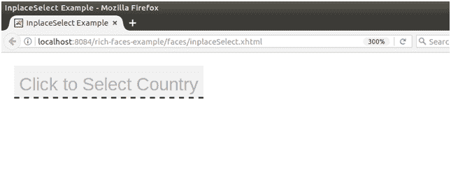

# richfaces〔t0〕

> 原文：<https://www.javatpoint.com/richfaces-rich-inplaceselect>

该组件类似于< **rich:inplaceInput** >组件，只是它使用下拉选择框来输入文本，而不是文本字段。

它基于 JSF 智能电子组件。因此，我们可以使用属性进行值定义、处理、转换和验证。

## 样式类和外观参数

下表包含位置选择的样式类和相应的外观参数。

| 班级 | 功能 | 皮肤参数 | 映射的 CSS 属性 |
| 。rf-is | 当就地选择处于默认状态时，此类为其定义样式。 | 编辑器背景颜色常规文本颜色 | 背景色边框-底部颜色 |
| 。射频行动 | 此类为处于编辑状态的就地选择定义样式。 | 没有皮肤参数。 |  |
| 。rf-is-chng | 该类为处于已更改状态的就地选择定义样式。 | 没有皮肤参数。 |  |
| 。射频识别系统 | 当就地选择处于禁用状态时，此类为其定义样式。 | 没有皮肤参数。 |  |
| 。rf-is-fld | 此类定义了就地选择字段的样式。 | 编辑背景颜色常规文本颜色 | 背景颜色 |
| 。射频选择 | 此类为就地选择选项定义样式。 | 常规文本颜色 | 边框颜色 |
| 。射频自激 | 此类为就地选择的选定选项定义样式。 | 常规文本颜色 | 边框颜色 |
| 。rf-is-lbl | 此类为内建选择的标签定义样式。 | 没有皮肤参数。 |  |
| 。rf-is-dflt-lbl | 此类为内建选择的默认标签定义样式。 | 没有皮肤参数。 |  |
| 。编辑射频 | 该类为正在编辑的就地选择定义样式。 | 没有皮肤参数。 |  |
| 。rf-is-btn | 此类定义了就地选择按钮的样式。 | tab background color panel bordercolor | 背景色边框颜色 |

* * *

## 例子

在下面的例子中，我们实现了< **rich:inplaceSelect** >组件。本示例包含以下文件。

### JSF 档案

**// inplaceSelect.xhtml**

```java

<?xml version='1.0' encoding='UTF-8' ?>
<!DOCTYPE html PUBLIC "-//W3C//DTD XHTML 1.0 Transitional//EN""http://www.w3.org/TR/xhtml1/DTD/xhtml1-transitional.dtd">
<ui:composition 
xmlns:h="http://java.sun.com/jsf/html"
xmlns:f="http://java.sun.com/jsf/core"
xmlns:ui="http://java.sun.com/jsf/facelets"
xmlns:a4j="http://richfaces.org/a4j"
xmlns:rich="http://richfaces.org/rich">
<f:view>
<h:head>
<title>InplaceSelect Example</title>
</h:head>
<h:body>
<h:form>
<rich:inplaceSelect value="#{country.countryName}" defaultLabel="Click to Select Country">
<f:selectItems value="#{country.countryList()}"></f:selectItems>
</rich:inplaceSelect>
</h:form>
</h:body>
</f:view>
</ui:composition>

```

### 托管 Bean

**//Country.java**

```java

import java.util.ArrayList;
import java.util.List;
import javax.faces.bean.ManagedBean;
import javax.faces.bean.RequestScoped;
@ManagedBean
@RequestScoped
public class Country {
String CountryName;
public List<String> countryList() {
ArrayList<String> list = new ArrayList<>();
list.add("India");
list.add("Australia");
list.add("Germany");
list.add("Italy");
list.add("United States");
list.add("Russia");
return list;
}
public String getCountryName() {
return CountryName;
}
public void setCountryName(String CountryName) {
this.CountryName = CountryName;
}
}

```

输出:



当用户点击它时，它会弹出一个列表。


* * *