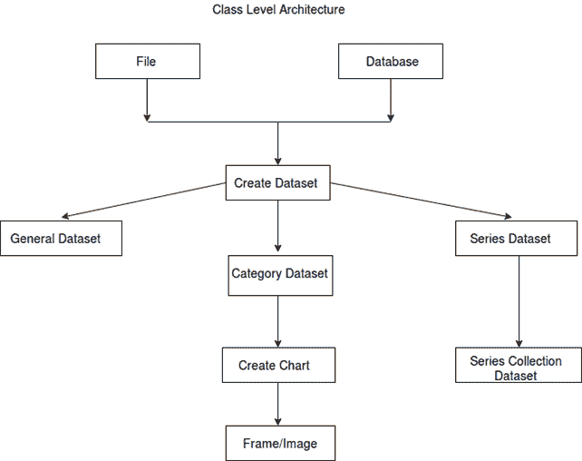
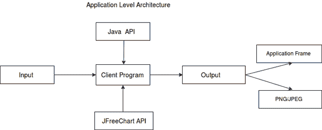

# JFreeChart 架构

> 原文：<https://www.javatpoint.com/jfreechart-architecture>

JFreeChart 的库包含两个层次的架构来定义它的不同类之间的交互。

## 1)类级架构:

基本的类级体系结构表示 JFreeChart 库中存在的各种类如何相互作用以产生各种类型的图表。

*   **文件**代表用于在文件中创建数据集的用户输入。
*   **数据库**表示具有用于在数据库中创建数据集的用户输入的源。
*   **创建数据集**表示正在创建并存储到对象中的数据集。
*   **通用数据集**是一种用于创建饼图的数据集。
*   **类别数据集**是一种广泛用于条形图、折线图等的数据集。
*   **系列数据集**是一种用于存储系列数据和构建折线图的数据集。
*   **系列集合数据集**表示添加到系列集合数据集的系列数据集的各种类别。这种类型的数据集用于苏木精图表。
*   **创建图表**是创建最终图表的方法。
*   **帧/图像**表示图表显示在摆动帧上或创建了图像。

## 2)应用级架构:

应用层架构显示了 JFreeChart 库在 java 应用程序中的位置。

*   客户端程序接收用户数据。
*   标准的 Java 和 JFreeChart APIs 用于以框架的形式生成输出，框架可以直接显示在应用程序内部，也可以独立地以 JPEG 或 PNG 等图像格式显示。