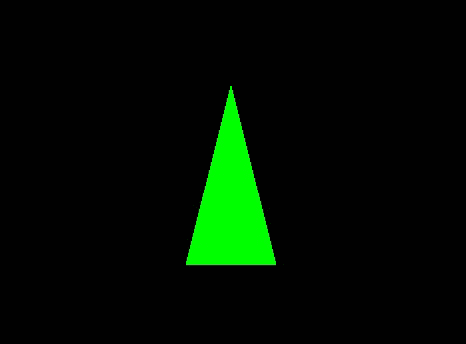

# 游戏旋转

> 原文：<https://www.javatpoint.com/jogl-rotation>

在 JOGL，物体可以沿着三个轴中的任何一个向任何方向旋转。要旋转对象，您需要遵循以下步骤:-

*   移除对象的前一状态以清除视图。为此，您需要使用以下方法清除颜色和深度缓冲区:-

```java

gl.glClear (GL2.GL_COLOR_BUFFER_BIT | GL2.GL_DEPTH_BUFFER_BIT )

```

*   现在，借助 glLoadIntensity()方法重置项目矩阵
*   调用 GLMatrixFunc 接口的 glRotatef()方法。

## 每秒帧数动画师类

FPSAnimator 类是 Animator 类的一个子类，用于以每秒帧数的速度旋转对象。

### FPSAnimator 类的构造函数

| 构造器 | 描述 |
| fpsanitator(int fps) | 它用指定的每秒目标帧数创建一个 FPSAnimator。 |
| fpsanitator(glautodrawenabled raw，int fps) | 它创建了一个 FPSAnimator，其初始可绘制动画并具有每秒目标帧数的指定值。 |
| fpsanitator(glautodrawnabledrawable、int fps、布林增益像素阵列) | 它创建了一个 FPSAnimator，该 FPSAnimator 具有一个可动画化的、指定的每秒目标帧数值和一个指定是否使用固定速率调度的标志。 |
| FPSAnimator(int fps，booleanscheduleAtFixedRate) | 它创建一个 FPSAnimator，目标帧/秒的指定值是一个指定是否使用固定速率调度的标志。 |

## JOGL 旋转示例

在这个例子中，我们将旋转一个三角形。

```java

package com.javatpoint.jogl;
import javax.media.opengl.GL2; 

import javax.media.opengl.*;
import javax.media.opengl.awt.GLCanvas; 

import javax.swing.JFrame; 

import com.jogamp.opengl.util.FPSAnimator; 

public class JRotation implements GLEventListener { 
public float rotation; 

   @Override 
public void display( GLAutoDrawable drawable ) {

final GL2 gl = drawable.getGL().getGL2(); 
gl.glClear (GL2.GL_COLOR_BUFFER_BIT |  GL2.GL_DEPTH_BUFFER_BIT );  

      // Clear The Screen And The Depth Buffer 
gl.glLoadIdentity();  // Reset The View     

      //triangle rotation      
gl.glRotatef( rotation, 0.0f, 1.0f, 0.0f );  

gl.glBegin(GL2.GL_TRIANGLES);     
      //Green Color
gl.glColor3f( 0.0f,1.0f,0.0f ); 
gl.glVertex2d(0,0.5);
gl.glVertex2d(-0.5,-0.5);
gl.glVertex2d(0.5,-0.5);

gl.glEnd();

gl.glFlush(); 
      //Assign the angle
rotation += 0.6f;  
   } 

   @Override 
public void dispose( GLAutoDrawable arg0 ) { 
      //method body 
   } 

   @Override 
public void init( GLAutoDrawable arg0 ) { 
      // method body 
   }

   @Override 
public void reshape( GLAutoDrawable drawable, int x, int y, int width, int height ) { 
   }
public static void main( String[] args ) {

final GLProfile gp  = GLProfile.get(GLProfile.GL2 ); 
GLCapabilities cap  = new GLCapabilities(gp);

final GLCanvas gc = new GLCanvas(cap); 
JRotation jr = new JRotation(); 
gc.addGLEventListener(jr); 
gc.setSize( 400, 400 );  

final JFrame frame = new JFrame("JOGL Rotation");

frame.add(gc);
	frame.setSize(500,400);
	frame.setVisible(true); 

final FPSAnimator animator = new FPSAnimator(gc, 400,true); 
animator.start(); 

   } 

} 

```

**输出:**

