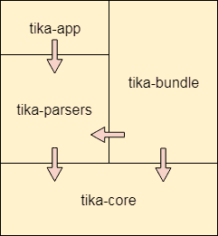

# Tika 组件堆栈

> 原文：<https://www.javatpoint.com/tika-component-stack>

Tika 由形成组件堆栈的四个组件组成。下图显示了组件位置和相互作用。

## 蒂卡-核心

它是一个基础组件，其他三个包组件都是基于它构建的。它提供以下内容。

1.  Tika 门面&检测 MIME 类型的类。所有的 MIME 类都组织在 **org.apache.tika.mime** 包中。
2.  核心解析器接口。
3.  位于 **org.apache.tika.language** 包中的语言标识符接口。
4.  核心元数据结构组织成 **org.apache.tika.metadata** 包。
5.  输出存储在 **org.apache.tika.sax** 包中的结构化文本的方法。

## 蒂卡解析器

它代表了不同解析库的 Tika 包装器。它还提供了通用 Parser 接口的实现。Tika-parser 提供了解析文本和元数据所需的所有类和方法。

## Tika-App

这是一个提供 Tika 命令行和图形用户界面的应用程序。它位于 tika 解析器的顶部。我们可以从命令行运行它，它显示了一个可以拖动文件的窗口。它生成被拖动文件的提取内容和元数据。要使用它，我们可以从 tika 的官方网站安装它。它是一个 jar 文件，所以我们可以使用 java 命令来执行它。

## 蒂卡束

它是 Tiks 的四个组件之一，用于提供开放服务网关计划(OGSI)包。融入 OGSI 环境有助于提卡。

OGSI 是一个软件组件模型，有助于用 Java 开发基于组件的应用程序。它类似于 Java Beans，支持模块化软件开发方法。

tika 捆绑包的创建是因为最近的 Tika 部署需要包含完整的 Tika 堆栈(理想情况下是 tika-app)。