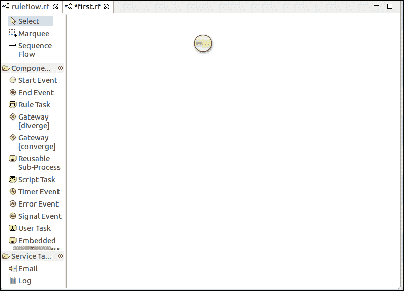
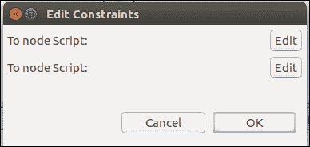
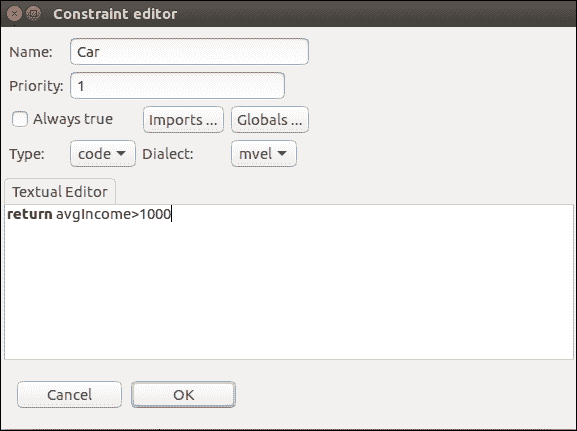
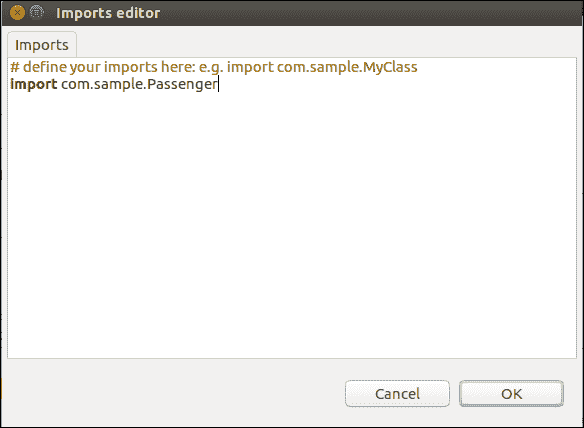
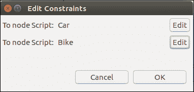
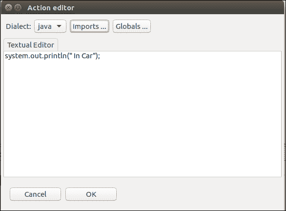

# jBPM 工作流验证

> 原文：<https://www.javatpoint.com/jbpm-workflow-validation>

**验证**是使某物在法律上或官方上被接受的行为。要了解**工作流验证**，我们必须遵循以下步骤:

**第一步。**打开空白**射频**或 **bpmn** 文件。

**第二步。**借助**组件面板**和**绘制一个事件，拖动**和**将**放到右侧。

这里我们采用开始事件、发散网关、收敛网关、脚本任务、结束事件、序列流等。上面是一个空白的工作流，没有任何事件的描述。

**第三步。**检查验证转到**窗口- >首选项- >验证**

**第四步。**如果发现任何错误，我们可以在**问题**区域看到。

**第五步。**现在我们将为每个**事件任务**设置属性。选择**发散网关****点击属性上的**，然后选择**类型**，选择想要的**门**。

**第六步。**再次选择**约束**和**点击**动作**属性上的**，出现如下画面。

**第七步。**点击**编辑**按钮，**填写**详细信息。

**第八步。**现在点击**导入**按钮，选择我们要执行操作的类。在这里我们将**进口**在我们的例子中**乘客 POJO** 。

**第九步。**对另一个**节点**脚本执行同样的操作，出现以下屏幕，点击**确定**。

**第十步。**现在我们选择**脚本任务**，并对**发散网关**进行同样的操作。屏幕显示为:

**第 11 步。**同样，对另一个**脚本任务**进行同样的操作。

**第 12 步。**现在我们保存**工作流程**并检查**验证**。如果发现任何错误，请再次检查，否则，问题已解决。该流程是在 **jBPM5** 中创建和解决的**工作流验证**。