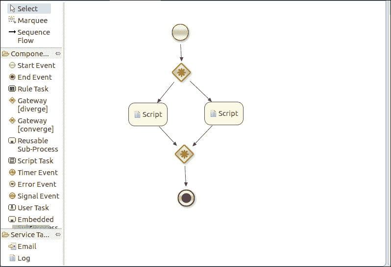
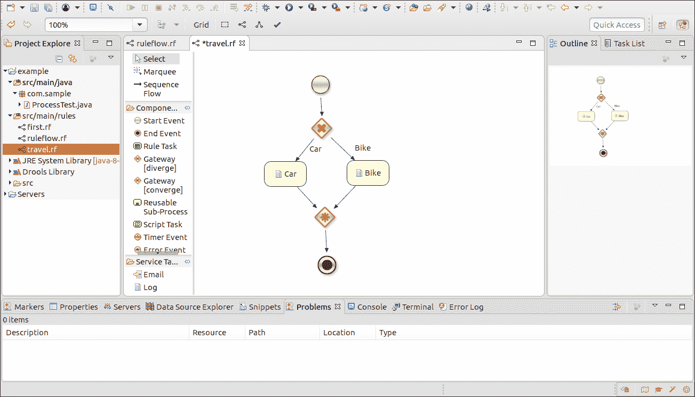
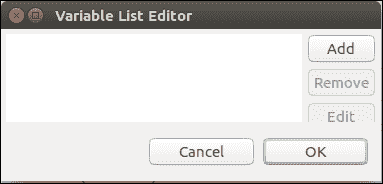
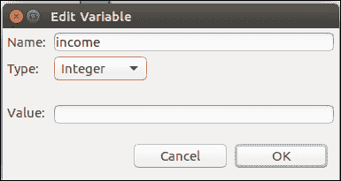

# jBPM 工作流示例

> 原文：<https://www.javatpoint.com/jbpm-workflow-example>

我们将举一个乘客的例子，他将决定开车还是骑自行车旅行。借助以下步骤，我们可以将 **jBPM** 工作流的工作理解为实践:

**第一步:**打开空白**。在 **Eclipse** 编辑器中打开**文件，使用**拖放**绘制以下工作流组件。



**步骤 2:** 设置每个**事件任务**的属性，正如我们之前在**验证**部分看到的，出现以下屏幕。



**第三步:**现在我们将更改**规则流 Id** 并在属性中设置**变量**。要设置**变量**点击**动作**变量属性，出现如下画面:



**第四步:**点击**添加**按钮，设置字段如下截图。



**第五步:**现在我们的属性看起来像是在我们设置了 **Id** 和**变量**的屏幕下面。


**第 6 步:**我们在**ProcessTest.java**类文件中做了一些更改来运行我们的流程。我们可以看到**粗体**字体的变化:

```java
public static final void main(String[] args) {
        try {
            // load up the knowledge base
            KnowledgeBase kbase = readKnowledgeBase();
            StatefulKnowledgeSession ksession = kbase.newStatefulKnowledgeSession();
            KnowledgeRuntimeLogger logger = KnowledgeRuntimeLoggerFactory.newFileLogger(ksession, "test");

            Map<String, Object> params = new HashMap<String, Object>();
            params.put("income", 1500);
            // start a new process instance
            ksession.startProcess("joe.ruleflow", params);

            logger.close();
        } catch (Throwable t) {
            t.printStackTrace();
        }
    }

```

**步骤 7:** 现在我们在与**ProcessTest.java**相同的包中创建**Passenger.java**文件

```java
public class Passenger {
		   private String name;
		   private int income;
		   public String getname()
		   {        		   
		       return this.name;
		   }
		   public void setname(String value)
		   {        		        
		        this.name = value;
		   }
		   public int getincome()
		   {        		        
		       return this.income;
		   }
		   public void setincome(Integer value)
		   {       		        
		        this.income = value;
		   }

```

**第 8 步:**现在我们以 Java Application 的形式运行**ProcessTest.java**文件，并查看输出。


**第 9 步:**我们再次更改 **params.put()** 函数中的值，并重新运行 Java 应用程序，查看输出的变化。

```java
params.put("income", 500);

```

