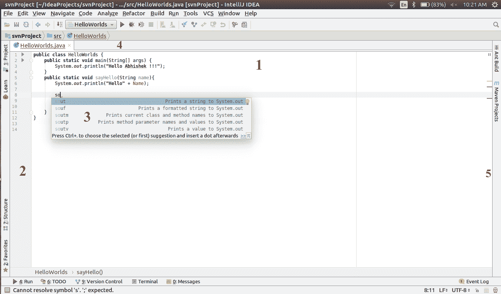
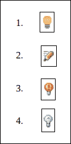

# IntelliJ IDEA 代码编辑器元素

> 原文：<https://www.javatpoint.com/intellij-idea-code-editor-elements>

编辑器提供了便于在代码中导航并识别其问题的元素。本节讨论编辑器的视觉元素及其最常见的操作。在下面的截图中，我们可以看到编辑器是如何划分的-

### 1.编辑区

这是开发人员花费大部分时间来实现他们的逻辑的主要领域，也可以在以后编辑它。

### 2.檐槽面积

装订线区域是显示不同类型代码信息的区域。它提供了运行、调试和运行应用程序的选项。檐槽区域表示以下信息-

*   行数
*   断点
*   范围
*   相互指向的箭头表示方法的开始和结束位置。

### 3.智能代码完成弹出窗口

智能代码完成弹出窗口根据代码的当前上下文为开发人员提供快速帮助。

### 4.文档选项卡区域

文档选项卡区域显示所有打开的文档选项卡。每个文档选项卡都有不同的含义，可以通过显示的文件名中的颜色来识别。这些颜色是**蓝色**表示“已修改”，**绿色**表示“新”，**红色**表示“不在 VCS”，**黑色**表示“未更改”。

### 5.标记栏

标记栏显示代码的**当前状态**。它用不同的颜色突出显示代码的状态。**绿色**表示代码为 **OK，黄色**表示**警告**，红色**表示**编译错误**。**

### 6.浮动图标

*   第一个图标表示代码修改。它只涵盖了警告更正，以改进我们的代码。它没有告诉我们必须修改我们的代码。
*   第二个图标仅表示意图操作。它没有提供任何改进或代码修改。
*   第三个图标表示快速修复操作。它提供了纠正一个明显的代码错误。
*   第四个图标表示警报操作。