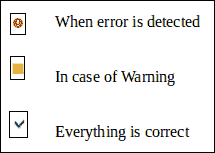
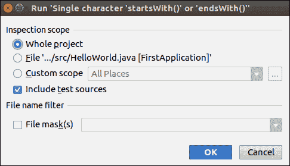

# IntelliJ IDEA 代码检查

> 原文：<https://www.javatpoint.com/intellij-idea-code-inspection>

Inspection 是一个静态代码分析工具，它可以帮助我们发现运行时错误、定位死代码、检测性能问题、内存泄漏、拼写问题，还可以改进整体代码结构。它不仅告诉我们代码中的问题在哪里，还建议立即更正。当我们对以下项目进行代码分析时，代码检查是可用的

1.  整个项目
2.  特定文件
3.  自定义范围

默认情况下，IntelliJ IDEA 对所有打开的文件执行分析。如果在项目中检测到错误，那么我们将在编辑器的右上角看到以下图标-

## 运行代码检查

运行代码检查有两种方法-

### 1.检查代码

*   在编辑器中打开文件。
*   转到**分析- >检查代码**。
*   对话框打开。选择以下选项之一-

*   整个项目
*   特定文件
*   自定义范围

*   指定**检查轮廓**
*   点击**确定**按钮。

### 2.按名称运行检查

*   在编辑器中打开文件。
*   转到**分析- >按名称运行检查**。
*   对话框打开。输入**检验名称**
*   新窗口将会打开。选择以下选项之一-

*   整个项目
*   特定文件
*   自定义范围

*   选择**包括测试源**复选框。
*   选择**文件掩码**，如果我们想仅在与特定掩码匹配的文件中应用检查。点击**确定**。

## 检验概况

在代码检查过程中，我们还可以告诉 *IntelliJ IDEA* 我们想要搜索的问题类型，并获得关于它们的报告。此操作可由检验配置文件执行。检查配置文件可以适用于两者:整个集成开发环境或仅适用于特定项目。