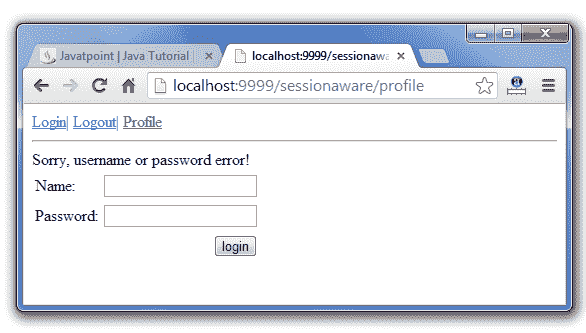
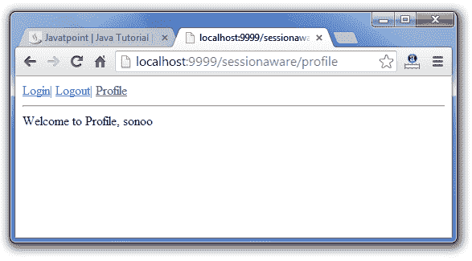

# 会话软件接口示例

> 原文：<https://www.javatpoint.com/struts-2-SessionAware-interface-example>

1.  [会话软件接口示例](#)
2.  [SessionMap 类](#)
3.  [session ware 界面示例](#)

动作类必须实现**会话软件**接口，以将信息存储在会话范围内。

### 会话软件接口的方法

它只包含一个方法 setSession。

| 公共抽象方法 | 描述 |
| **无效设置会话(地图<字符串，对象>地图)** | struts 框架通过传递 SessionMap 类的实例来调用这个方法。 |

### SessionMap 类

struts 2 框架传递**org . Apache . struts 2 . dispatcher . session map**的实例。它扩展了 **java.util.AbstractMap** 类，该类实现了 **java.util.Map.SessionMap** 。SessionMap 类有很多有用的方法。

### SessionMap 类的方法

SessionMap 类的常用方法如下:

| 方法 | 描述 |
| **公共对象放入(对象键，对象值)** | 将属性存储在 HttpSession 对象中。 |
| **公共对象移除(对象键)** | 移除指定键的属性并返回属性值。 |
| **公共对象获取(对象密钥)** | 从 HttpSession 对象返回相应键的值。 |
| **公共集 entrySet()** | 返回一个 set 对象，其中包含在 HttpSession 对象中设置的所有键和值对象。 |
| **公开作废作废()** | 使当前的 HttpSession 对象无效。 |
| **公共作废清除()** | 移除 HttpSession 对象中设置的所有属性。 |

### 会话软件接口示例

本示例包含三个链接**登录**、**注销**和**档案**。在登录之前，您不能单击配置文件页面。登录后，您可以转到个人资料页面。如果最终用户单击注销链接，他将无法访问配置文件页面。

步骤如下:

1.  **添加 struts 和 servlet 库**
2.  **index.jsp**用于提供登录、注销和个人资料的链接。
3.  **struts.xml** 用于定义结果和动作。
4.  **Login.java**用于定义登录和注销逻辑。
5.  **Profile.java**检查用户是否登录。
6.  **查看组件**显示结果。

### 1)添加 struts 和 servlet 库

您需要添加 struts 2 和 servlet 库。

[download the struts2 jar files](https://static.javatpoint.com/src/st/struts2jars.zip)[download the servlet-api.jar file](src/servlet/servlet-api.zip)

* * *

### 2)创建用于输入的 index.jsp

这个 jsp 页面为登录、注销和配置文件创建了三个链接。

**index.jsp**

```java
<a href="loginform">Login</a>|
<a href="logout">Logout</a>|
<a href="profile">Profile</a>

```

### 3)在 struts.xml 中定义动作和结果

这个 xml 文件定义了一个包和 4 个动作。每个操作至少定义一个结果页面。

对于 loginprocess 和注销操作，我们使用相同的操作类，但是调用方法不同。

**struts.xml**

```java
<?xml version="1.0" encoding="UTF-8" ?>
<!DOCTYPE struts PUBLIC "-//Apache Software Foundation//DTD Struts Configuration 2.1//EN" "http://struts.apache.org/dtds/struts-2.1.dtd">
<struts>

<constant name="struts.devMode" value="true"></constant>

<package name="abc" extends="struts-default" >

<action name="loginform">
<result>login.jsp</result>
</action>

<action name="login" class="com.javatpoint.Login" method="execute">
<result name="success">/login-success.jsp</result>
<result name="login">/login-error.jsp</result>
</action>

<action name="logout" class="com.javatpoint.Login" method="logout">
<result name="success">/logout-success.jsp</result>
</action>

 <action name="profile" class="com.javatpoint.Profile" method="execute">
<result name="success">/profile-success.jsp</result>
<result name="login">/profile-error.jsp</result>
</action>
</package>
</struts>    

```

### 4)创建用于登录和注销的操作类

这个动作类实现了 SessionAware 接口，并重写了 setSession 方法来存储会话范围内的信息。

注销时，我们只是调用**会话地图**的 **invalidate()** 方法。

**Login.java**

```java
package com.javatpoint;

import java.util.Map;

import org.apache.struts2.dispatcher.SessionMap;
import org.apache.struts2.interceptor.SessionAware;

public class Login implements SessionAware{
private String name,password;
private SessionMap<String,Object> sessionMap;

//getters and setters

@Override
public void setSession(Map<String, Object> map) {
	sessionMap=(SessionMap)map;
}

public String execute(){
if(password.equals("admin")){
	sessionMap.put("login","true");
	sessionMap.put("name",name);

	return "success";
}
else{
	return "login";
}
}

public String logout(){
	if(sessionMap!=null){
		sessionMap.invalidate();
	}
	return "success";
}

}

```

### 5)创建配置文件类

此类从会话范围获取信息，如果在具有登录名的会话范围中找到任何信息，则返回成功，否则返回 false。

**Profile.java**

```java
package com.javatpoint;

import javax.servlet.http.HttpSession;
import org.apache.struts2.ServletActionContext;

public class Profile{

	public String execute(){
		HttpSession session=ServletActionContext.getRequest().getSession(false);
		if(session==null || session.getAttribute("login")==null){
			return "login";
		}
		else{
			return "success";
		}
	}
}

```

### 6)创建视图组件

有许多视图组件:

*   login.jsp
*   login-success.jsp
*   login-error.jsp
*   logout-success.jsp
*   profile-success.jsp
*   profile-error.jsp

### 查看登录组件

**login.jsp**

此页面创建登录表单。

```java
<%@ taglib uri="/struts-tags" prefix="s" %>

<s:form action="login">
<s:textfield name="name" label="Name"></s:textfield>
<s:password name="password" label="Password"></s:password>
<s:submit value="login"></s:submit>
</s:form>

```

**login-success.jsp**

此页面打印带有用户名的欢迎消息。

```java
<jsp:include page="index.jsp"></jsp:include>
<hr>
<%@ taglib uri="/struts-tags" prefix="s" %>

Welcome, <s:property value="#session.name"/>

```

**login-error.jsp**

此页面显示错误消息。

```java
<jsp:include page="index.jsp"></jsp:include>
<hr>
Sorry, username or password error!
<jsp:include page="login.jsp"></jsp:include>

```

* * *

### 查看注销组件

**logout-success.jsp**

此页面仅显示成功注销的消息。

```java
<jsp:include page="index.jsp"></jsp:include>
<hr>
<p>You are successfully logged out!</p>

```

* * *

### 查看配置文件的组件

**profile-success.jsp**

此页面打印欢迎使用个人资料消息。

```java
<jsp:include page="index.jsp"></jsp:include>
<hr>
<%@ taglib uri="/struts-tags" prefix="s" %>

Welcome to Profile, <s:property value="#session.name"/>

```

**profile-error.jsp**

该页面打印要首先登录的消息，并包括 login 页面。

```java
<jsp:include page="index.jsp"></jsp:include>
<hr>
Sorry, username or password error!
<jsp:include page="login.jsp"></jsp:include>

```

* * *

[download this example (developed in Eclipse IDE without jar)](https://static.javatpoint.com/src/st/eclipse/sessionaware.zip)[download this example (developed in Myeclipse IDE)](https://static.javatpoint.com/src/st/sessionaware.zip)

* * *

### 输出


如果您点击个人资料链接，您将被转发到 profile-error.jsp



现在把你的名字写成名字，把管理员写成密码。


现在，您已成功登录


现在，点击简介。



### 推荐主题

[Login and Logout Example with Oracle database](struts-2-login-and-logout-example)