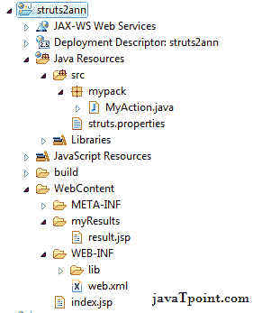
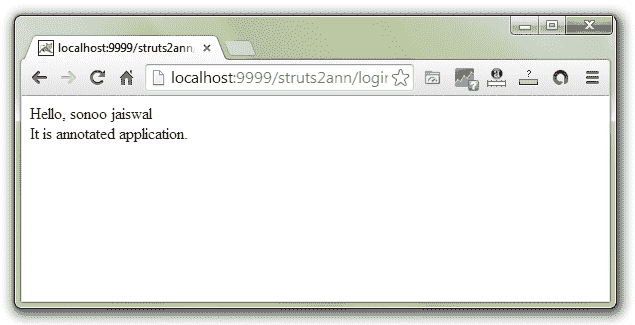

# Struts 2 注释示例

> 原文:[https://www.javatpoint.com/struts-2-annotations-example](https://www.javatpoint.com/struts-2-annotations-example)

1.  [Struts 2 注释](#)
2.  [使用注释的 Struts 2 应用程序示例](#)

Struts 2 为您提供了使用注释创建 Struts 应用程序的便捷方式。所以，不需要 struts.xml 文件。

如前所述，有两种方法可以使用零配置文件(没有 struts.xml 文件)。

1.  按照惯例
2.  通过注释

* * *

## struts 2 应用程序中使用的注释

对于 struts 2 的简单注释示例，我们可以使用 3 个注释:

1) **@Action** 标注用于标注动作类。

2) **@Results** 标注用于为一个动作定义多个结果。

3)**@结果**标注用于显示单个结果。

* * *

## 使用注释的 struts 2 应用程序示例

您需要为 struts 注释应用程序创建 4 个文件:

1.  index.jsp
2.  动作类
3.  src 目录中的 struts.properties
4.  结果页面
5.  web.xml 文件

先来看看**目录结构**。



### 1)创建用于输入的 index.jsp

这个 jsp 页面使用 struts UI 标记创建一个表单，该表单接收来自用户的名称。

**index.jsp**

```java
<%@ taglib prefix="s" uri="/struts-tags" %>

<s:form action="myAction" >
<s:textfield name="name" label="Name" />
<s:submit />
</s:form>

```

### 2)创建动作类

这个动作类使用动作和结果的注释。

**RegisterAction.java**

```java
package mypack;
import org.apache.struts2.convention.annotation.*;

@Action(value="myAction",results={@Result(name="ok",location="/myResults/result.jsp")})
public class MyAction {
private String name;
public String getName() {
	return name;
}
public void setName(String name) {
	this.name = name;
}
public String execute()
{
return "ok";	
}
}

```

### 3)在 src 目录中创建 struts.properties 文件

**struts.properties**

```java
struts.convention.package.locators=mypack
struts.convention.result.path=/myResults
struts.convention.action.mapAllMatches=true

```

### 4)创建 result.jsp 以显示消息

这个 jsp 页面显示用户名。

**result.jsp**

```java
<%@ taglib prefix="s" uri="/struts-tags" %>
Hello, <s:property value="name" /> It is annotated application.

```

* * *

[download this example developed in eclipse ide (without jar)](https://static.javatpoint.com/src/st/eclipse/struts2ann.zip)

* * *

#### 输出

 