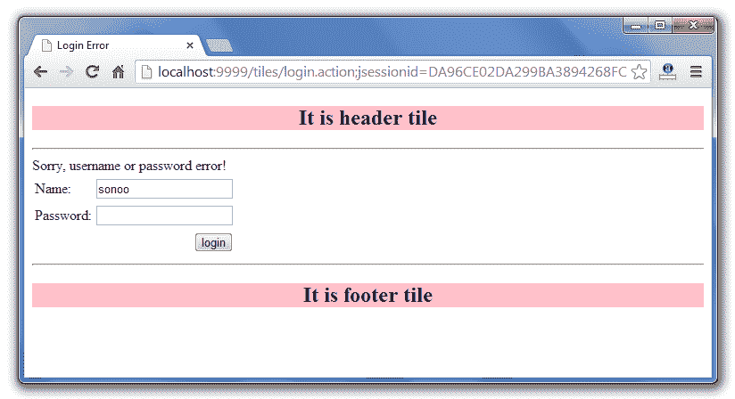

# Struts 2 Tiles 框架集成教程示例

> 原文:[https://www . javatpoint . com/struts-2-tiles-framework-integration-tutorial-示例](https://www.javatpoint.com/struts-2-tiles-framework-integration-tutorial-example)

1.  [支柱 2 瓦集成](#)
2.  [Struts 2 Tiles 集成的 8 个步骤](#)

我们可以通过与 tiles 框架集成来定制 struts 2 应用程序的布局。

一个网页可以包含许多部分(称为平铺)，如页眉、左窗格、右窗格、正文部分、页脚等。在平铺框架中，我们通过**布局管理器**页面管理所有的平铺。

* * *

### 瓷砖框架的优势

瓷砖框架有以下优点:

*   **按集中页面定制**我们只能按单个页面(集中页面)定制所有页面的布局。
*   **代码可重用性**单个部分，例如页眉或页脚，可以在许多页面中使用。所以它节省了编码。
*   **容易修改**如果修改了任何部分(平铺)，我们不需要修改很多页。
*   **容易移除**如果页面的任何部分(平铺)被移除，我们不需要移除所有页面的代码。我们可以从布局管理器页面中移除图块。


* * *

### 创建切片应用程序的步骤

步骤如下:

1.  **在应用程序中添加图块库**
2.  **在 web.xml 文件中定义结构 2 文件服务器**
3.  **创建输入页面(index.jsp)**
4.  **创建动作类**
5.  **在您的包中扩展切片-默认包，并将所有结果类型定义为 struts.xml 文件中的切片**
6.  **创建 tiles.xml 文件并定义所有的 tiles 定义**
7.  **创建布局管理器页面**
8.  **创建视图组件**

* * *

### 1)在应用程序中添加切片库

如果您正在使用 myeclipse IDE，您可以通过右键单击项目->构建路径->添加库->添加 myeclipse 库->选择 Struts 2 切片库->确定来添加切片库。

如果您正在使用 eclipse 或 Netbeans IDE，您需要在项目中添加所需的切片库。

[download the struts2 jar files](https://static.javatpoint.com/src/st/struts2jars.zip)

* * *

### 2)在 web.xml 文件中定义结构 2 文件监听器

在 web.xml 文件中提供侦听器类 Struts2TilesListener 的条目。

**web.xml**

```java
<?xml version="1.0" encoding="UTF-8"?>
<web-app version="2.5" 

	xmlns:xsi="http://www.w3.org/2001/XMLSchema-instance" 
	xsi:schemaLocation="http://java.sun.com/xml/ns/javaee 
	http://java.sun.com/xml/ns/javaee/web-app_2_5.xsd">
  <welcome-file-list>
    <welcome-file>index.jsp</welcome-file>
  </welcome-file-list>
  <filter>
   <filter-name>struts2</filter-name>
   <filter-class>
    org.apache.struts2.dispatcher.ng.filter.StrutsPrepareAndExecuteFilter
   </filter-class>
  </filter>
  <filter-mapping>
  	<filter-name>struts2</filter-name>
  	<url-pattern>/*</url-pattern>
  </filter-mapping>

  <listener>
  <listener-class>org.apache.struts2.tiles.StrutsTilesListener</listener-class>
  </listener>

 </web-app>

```

* * *

### 3)创建输入页面(index.jsp)

**index.jsp**

```java
<%@ taglib uri="/struts-tags" prefix="s" %>

<s:form action="login">
<s:textfield name="name" label="Name"></s:textfield>
<s:password name="password" label="Password"></s:password>
<s:submit value="login"></s:submit>
</s:form>

```

* * *

### 4)创建动作类

此操作类包含一个字段名，并定义了执行方法。

**Login.java**

```java
package com.javatpoint;

public class Login {
private String name,password;

//getters and setters

public String execute(){
if(password.equals("admin")){
	return "success";
}
else{
	return "error";
}
}
}

```

* * *

### 5)继承切片-默认包，并将所有结果类型定义为 struts.xml 中的切片

这个 xml 文件定义了一个包含一个操作和两个结果的包。

**struts.xml**

```java
<?xml version="1.0" encoding="UTF-8" ?>
<!DOCTYPE struts PUBLIC "-//Apache Software Foundation//DTD Struts Configuration 2.1//EN" 
"http://struts.apache.org/dtds/struts-2.1.dtd">
<struts>

<package name="abc" extends="tiles-default" >

<action name="login" class="com.javatpoint.Login">
<result name="success" type="tiles">login-success</result>
<result name="error" type="tiles">login-error</result>
</action>

</package>
</struts>    

```

* * *

### 6)创建 tiles.xml 文件并定义所有的 tiles 定义

tiles.xml 文件必须位于 WEB-INF 目录中。

**tiles.xml**

```java
<?xml version="1.0" encoding="UTF-8" ?> 

<!DOCTYPE tiles-definitions PUBLIC 
"-//Apache Software Foundation//DTD Tiles Configuration 2.0//EN"
 "http://tiles.apache.org/dtds/tiles-config_2_0.dtd"> 

<tiles-definitions>

   <definition name="login-success" template="/layoutmanager.jsp"> 
   <put-attribute name="title" value="Welcome Page"/> 
   <put-attribute name="body" value="/login-success.jsp"/> 
   </definition>

   <definition name="login-error" template="/layoutmanager.jsp"> 
   <put-attribute name="title" value="Login Error"/> 
   <put-attribute name="body" value="/login-error.jsp"/> 
   </definition> 

</tiles-definitions>

```

* * *

### 7)创建布局管理器页面

这是布局管理器页面。它使用瓦片的 getAsString 标签来包含字符串资源，并使用瓦片的 insertAttribute 标签来包含页面资源。

**layoutmanager.jsp**

```java
<%@ taglib uri="http://tiles.apache.org/tags-tiles" prefix="tiles" %>
<!DOCTYPE html PUBLIC "-//W3C//DTD HTML 4.01 Transitional//EN"
 "http://www.w3.org/TR/html4/loose.dtd">
<html>
<head>
<title><tiles:getAsString name="title" /></title>
</head>
<body>

<%@  include file="header.jsp" %>
<tiles:insertAttribute name="body" />
<%@ include file="footer.jsp" %>

</body>
</html> 

```

* * *

### 8)创建视图组件

有许多视图组件，如 header.jsp、footer.jsp、welcome.jsp 等。

* * *

**header.jsp**

```java
<h2 style="background-color:pink;text-align:center;">It is header tile</h2>
<hr/>

```

* * *

**footer.jsp**

```java
<hr>
<h2 style="background-color:pink;text-align:center;">It is footer tile</h2>

```

* * *

**login-success.jsp**

```java
<%@ taglib uri="/struts-tags" prefix="s" %>

Welcome, <s:property value="name"/>

```

* * *

**login-error.jsp**

```java
Sorry, username or password error!
<jsp:include page="index.jsp"></jsp:include>

```

[download this example (developed by Eclipse IDE)](https://static.javatpoint.com/src/st/eclipse/tiles.zip)[download this example (developed by myeclipse IDE)](https://static.javatpoint.com/src/st/tiles.zip)

* * *

#### 输出:


密码不是管理员，因此将显示错误页面。

* * *



如果密码是 admin，将显示成功页面。


* * *

### 如何在 struts 2 应用程序中定义多个切片文件

要定义多个切片，您需要在您的 **web.xml** 文件中添加以下条目。

```java
<context-param id="struts_tiles">
 <param-name>org.apache.tiles.impl.BasicTilesContainer.DEFINITIONS_CONFIG</param-name>
 <param-value>/WEB-INF/tiles1.xml,/WEB-INF/tiles2.xml</param-value>
</context-param>

```