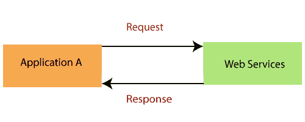

# 什么是网络服务？

> 原文:[https://www . javatpoint . com/restful-web-services-什么是 web-services](https://www.javatpoint.com/restful-web-services-what-is-web-services)

Web 服务是在分布式环境中使用标准化消息传递协议的互联网软件类型。它通过网络使用 **REST、SOAP、WSDL、**和 **UDDI** 集成了基于网络的应用程序。例如，Java web 服务可以与。Net 应用程序。

## 网络服务的特点

*   Web 服务是为应用程序之间的交互而设计的。
*   它应该是可互操作的。
*   它应该允许通过网络进行通信。

## 网络服务的组件

web 服务必须能够满足以下条件:

*   网络服务必须可以通过互联网访问。
*   网络服务可以通过像 UDDI 这样的通用机制被发现。
*   它必须能在任何编程语言或操作系统上互操作。

## 网络服务的使用

*   Web 服务用于重用代码和连接现有程序。
*   Web 服务可以用来在两个不同的平台之间链接数据。
*   它提供了不同应用程序之间的互操作性。

## 应用程序之间如何进行数据交换？

假设我们有一个**应用程序 A** ，它创建了一个访问**网络服务**的请求。网络服务提供了一系列服务。网络服务处理**请求**并将**响应**发送给应用程序 a。网络服务的输入称为请求，网络服务的输出称为响应。web 服务可以从不同的平台调用。



请求和响应有两种流行的格式 **XML** 和 **JSON** 。

**XML 格式:** XML 是 web 服务中作为请求和响应的流行形式。考虑以下 XML 代码:

```java
<getDetail>
<id>DataStructureCourse</id>
</getDetail>

```

该代码显示用户已请求访问 DataStrutureCourse。另一种数据交换格式是 JSON。JSON 有多种平台支持。

**JSON 格式:** JSON 是结构化数据的可读格式。它用于在服务器和 web 应用程序之间传输数据。

```java
[  
    "employee": 
   {  
        "id": 00987
        "name":       "Jack",   
        "salary":      20000,   
   }  
]  

```

为了使网络服务平台独立，我们使**请求**和**响应**平台独立。

现在出现了一个问题，**应用 A** 如何知道请求和响应的格式？

这个问题的答案是“服务定义”每个 web 服务都提供一个服务定义。服务定义指定了以下内容:

*   **请求/响应格式:**定义消费者发出的请求格式和 web 服务发出的响应格式。
*   **请求结构:**定义应用程序发出的请求的结构。
*   **响应结构:**定义 web 服务返回的响应结构。
*   **端点:**定义服务可用的位置。

* * *