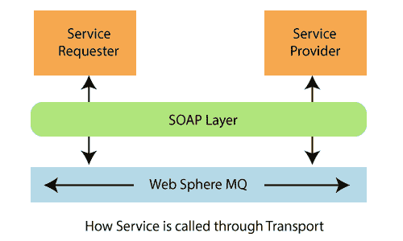

# 网络服务的关键术语

> 原文:[https://www . javatpoint . com/restful-web 服务-关键术语-web 服务](https://www.javatpoint.com/restful-web-services-key-terminology-of-web-services)

*   请求和响应
*   消息交换格式:XML 和 JSON
*   服务提供商或服务器
*   服务消费者或客户
*   服务定义
*   传输:HTTP 和 MQ

**请求和响应:**请求是 web 服务的输入，响应是 web 服务的输出。

**消息交换格式:**是请求和响应的格式。有两种流行的消息交换格式: **XML** 和 **JSON** 。

**服务提供商或服务器:**服务提供商是承载网络服务的提供商。

**服务消费者或客户端:**服务消费者是使用网络服务的人。

**服务定义:**服务定义是服务提供者和服务消费者之间的契约。服务定义定义了请求和响应的格式、请求结构、响应结构和端点。

**传输:**传输定义了服务的调用方式。有两种流行的服务调用方式: **HTTP** 和消息队列( **MQ** )。通过绑定服务的 URL，我们可以通过互联网调用服务。MQ 通过队列进行通信。服务请求者将请求放入队列。一旦服务提供商监听到请求。它接受请求，处理请求，创建响应，并将响应放回 MQ。服务请求者从队列中获取响应。通信通过队列进行。

* * *