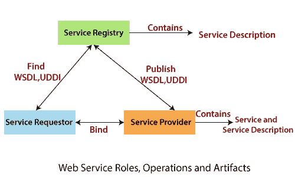
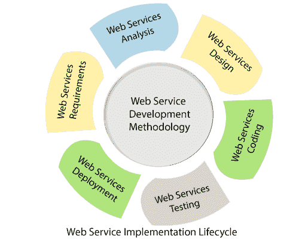

# 网络服务体系结构

> 原文:[https://www . javatpoint . com/restful-web 服务-web 服务架构](https://www.javatpoint.com/restful-web-services-architecture-of-web-services)

网络服务架构描述了如何以可互操作的方式实例化元素和实现操作。

web 服务的架构在三个角色之间交互:**服务提供者、服务请求者、**和**服务注册中心**。交互涉及到三个操作:**发布、查找、**和**绑定**。这些操作和角色作用于**网络服务工件**。web 服务工件是 web 服务软件模块及其描述。

服务提供商托管一个网络关联模块(web 服务)。它定义了 web 服务的服务描述，并将其发布到服务请求者或服务注册中心。这些服务请求者使用查找操作在本地或从服务注册中心检索服务描述。它使用服务描述与服务提供者绑定，并与 web 服务实现一起调用。

下图说明了操作、角色及其交互。

## 网络服务架构中的角色

web 服务体系结构中有三个角色:

*   互联网服务商
*   服务请求者
*   服务注册表

**服务提供商**

从架构的角度来看，它是承载服务的平台。

**服务请求者**

服务请求者是寻找并调用或启动与服务交互的应用程序。浏览器扮演请求者的角色，由消费者或没有用户界面的程序驱动。

**服务注册**

服务请求者在开发过程中找到服务并获取服务的绑定信息。

## 网络服务架构中的操作

微服务中发生的三种行为:

*   服务说明发布**(发布)**
*   服务描述的查找**(查找)**
*   基于服务描述调用服务**(绑定)**

**发布:**在发布操作中，必须发布服务描述，这样服务请求者才能找到服务。

**查找:**在查找操作中，服务请求者直接检索服务描述。对于服务请求者来说，它可能涉及两个不同的生命周期阶段:

*   在设计时，检索服务的接口描述用于程序开发的时间。
*   并且，在运行时检索服务的绑定和位置描述以供调用。

**绑定:**在绑定操作中，服务请求者在运行时使用服务描述中的绑定细节来定位、联系和调用服务，从而调用或发起与服务的交互。

## 网络服务的工件

web 服务有两个工件:

*   服务
*   服务注册表

**服务:**服务是由服务描述描述的**界面**。服务描述是服务的实现。服务是部署在由服务提供商提供的网络可访问平台上的软件模块。它与服务请求者交互。有时，它还充当请求者，在实现中使用其他网络服务。

**服务描述:**服务描述包括服务的**接口**和**实现**的细节。包括其**数据类型、操作、绑定信息、**和**网络位置**。它还可以对其他元数据进行分类，以便服务请求者能够发现和利用。它可以发布给服务请求者或服务注册中心。

## 网络服务实施生命周期

web 服务实现生命周期是指从需求到开发的 web 服务开发阶段。实施生命周期包括以下阶段:

*   需求阶段
*   分析阶段
*   设计阶段
*   编码阶段
*   测试阶段
*   部署阶段

**需求阶段**

需求阶段的目标是理解业务需求，并将它们转化为 web 服务需求。需求分析师应该进行需求启发(这是从用户、客户和其他利益相关者那里研究和发现系统需求的实践)。分析师应该解释、整合这些需求，并将其传达给开发团队。需求应该被分组到一个集中的存储库中，在那里它们可以被查看、区分优先级和挖掘交互特性。

**分析阶段**

分析阶段的目的是将 web 服务提炼并转化为概念模型，技术开发团队可以通过这些概念模型来理解。它还定义了高级结构，并标识了 web 服务接口契约。

**设计阶段**

在这个阶段，完成了 web 服务的详细设计。设计者定义在分析阶段已经确定的 web 服务接口契约。定义的 web 服务接口契约标识了元素和相应的数据类型，以及 web 服务和客户端之间的交互模式。

**编码阶段**

编码和调试阶段与其他基于软件组件的编码和调试阶段非常相似。主要区别在于创建额外的 web 服务接口包装、生成 WSDL 和客户端存根。

**测试阶段**

在这个阶段，测试人员执行平台和客户程序之间的互操作性测试。要进行的测试是为了确保 web 服务能够承受最大的负载和压力。其他任务，如 web 服务应用程序的概要分析和 SOAP 消息的检查，也应该在测试阶段执行。

**部署阶段**

部署阶段的目的是确保在分布式系统中正确部署 web 服务。它在测试阶段之后执行。部署者的主要任务是确保 web 服务已经被正确配置和管理。其他可选任务，如指定和向 UDDI 注册中心注册 web 服务，也在这个阶段完成。

## 网络服务栈或网络服务协议栈

要以可互操作的方式执行三个操作:发布、查找和绑定，必须有一个 **web 服务堆栈**。web 服务栈在每个级别都包含该标准。

在上图中，最上面的层建立在较低层提供的能力之上。三个垂直塔代表了应用于堆栈每一层的要求。右边的文本代表了适用于该堆栈层的技术。web 服务协议栈通常堆叠四种协议:

*   传输协议
*   消息协议
*   描述协议
*   发现协议

**(服务)传输协议:**网络层是 web 服务栈的基础。它负责在网络应用程序之间传输消息。HTTP 是互联网可用网络服务的网络协议。它还支持其他网络协议，如 **SMTP、FTP、**和 **BEEP** (块可扩展交换协议)。

**(XML)消息传递协议:**它负责以通用的 XML 格式对消息进行编码，以便他们可以在网络连接的任何一端进行理解。SOAP 是所选择的 XML 消息传递协议，因为它支持三种操作:发布、查找和绑定操作。

**(服务)描述协议:**用于描述特定 web 服务的公共接口。WSDL 是基于 XML 的服务描述的标准。WSDL 描述了服务交互的接口和机制。需要说明的是**业务背景、服务质量、**和**服务对服务**的关系。

**(服务)发现协议:**它是一个集中到公共注册表中的服务，以便网络 Web 服务可以发布它们的位置和描述。它使发现网络上哪些服务可用变得容易。

堆栈的前三层是提供或使用任何 web 服务所必需的。最简单的堆栈由用于网络层的 HTTP、用于基于 XML 的消息传递的 SOAP 协议和用于服务描述层的 WSDL 组成。这三层提供了互操作性，并使 web 服务能够控制现有的互联网基础设施。它创造了进入全球环境的低成本。

堆栈的底部三层确定了法规遵从性和互操作性的技术，接下来的两层- **服务发布**和**服务发现**可以用一系列解决方案来实现。

* * *