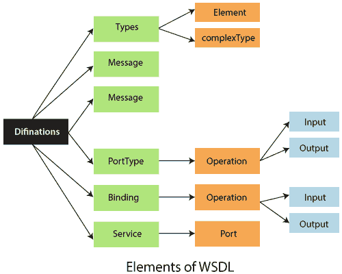

# 网络服务组件

> 原文:[https://www . javatpoint . com/restful-web-services-web-services-components](https://www.javatpoint.com/restful-web-services-web-services-components)

web 服务有两个组件:

*   网络服务描述语言(WSDL)
*   通用描述发现和集成(UDDI)

## 网络服务描述语言(WSDL)

**网络服务描述语言**的 WSDL 首字母缩写。WSDL 是一种基于 XML 的接口描述语言。它用于描述 web 服务提供的功能。有时它也被称为 WSDL 文件。WSDL 文件的扩展名是**。wsdl** 。它提供了机器可读的描述，描述了如何调用服务、需要什么参数以及返回什么数据结构。

它将服务描述为网络端点或端口的集合。它经常与 SOAP 和 XML 模式结合使用，在分布式环境中提供 XML 服务。简而言之，WSDL 的目的类似于编程语言中的类型签名。

WSDL 的当前版本是 2.0。1.1 版本没有得到 W3C 的认可。

### WSDL 元素

| WSDL 1.1 学期 | WSDL 2.0 学期 | 描述 |
| 服务 | 服务 | 它是一套系统功能。 |
| 港口 | 端点 | 它是定义绑定和网络地址组合的端点。 |
| 有约束力的 | 有约束力的 | 它指定了接口并定义了 SOAP 绑定样式。它还定义了操作。 |
| 端口类型 | 连接 | 一个或多个端点支持的一组抽象服务。 |
| 操作 | 操作 | 服务支持的操作的抽象细节。它定义了 SOAP 动作和编码消息的方式。 |
| 消息 | 不适用的 | 要通信的数据的抽象、类型化定义。W3C 已经删除了 WSDL 2.0 中的消息，其中直接引用了用于定义输入、输出和错误主体的 XML Schema 类型。 |
| 类型 | 类型 | 它是数据类型定义的容器。为此使用了 XML 模式语言(XSD)。 |

## 通用描述、发现和集成(UDDI)

**通用描述、发现、**和**集成**的 UDDI 首字母缩写。这是一个基于“T4”XML 的“T5”注册表，供全球企业在互联网上列出自己的名字。它定义了一组支持业务、组织或其他 web 服务提供商的描述和发现的服务。UDDI 提供服务以及可用于访问这些服务的技术接口。

UDDI 背后的想法是发现组织和组织提供的服务，就像使用电话簿一样。它允许企业按照名称、产品、位置或他们提供的 T2 网络服务列出自己。UDDI 的工作方式如下:

*   服务提供商在 UDDI 注册处注册其业务。
*   服务提供商向 UDDI 注册中心分别注册每项服务。
*   消费者在 UDDI 登记处查询业务和服务。
*   消费者将服务与服务提供商绑定并使用服务。

UDDI 商业登记系统有以下三个目录:

*   关于用户信息的数据库
*   电话黄页
*   绿色页面

**白页:**白页包含**公司名称、地址、电话号码、**等基本信息以及税号等其他业务标识。

**黄页:**黄页包含按相关业务分类组织的详细业务数据。黄页版本根据较新的 **NAICS** (北美行业分类系统)对业务进行分类。

**绿色页面:**绿色页面包含公司关键业务流程的信息，如**操作平台、支持的程序、**和**其他高级业务协议**。

* * *