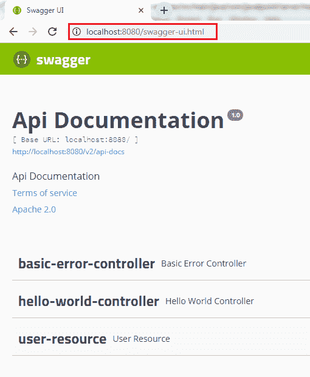

# 配置自动生成霸气文档

> 原文：<https://www.javatpoint.com/restful-web-services-swagger-ui>

## 时髦的

霸气是一个开源工具。它围绕 OpenAPI 规范构建，帮助开发人员设计、构建、记录和使用 RESTful APIs。它是 RESTful 网络服务最流行的应用编程接口文档格式。它同时提供了 JSON 和 UI 支持。JSON 可以作为一种机器可读的格式，而 swaggy-UI 是用于可视化显示的，人类只需浏览 API 文档就很容易理解。主要的 Swagger 工具有:

*   **swaggle UI:**它创建交互式 API 文档。
*   **swag Editor:**这是一个基于浏览器的编辑器，我们可以在这里编写 OpenAPI 规范。
*   **swaggle Codegen:**它生成服务器存根(API 实现存根)，客户端库形成 OpenAPI 规范。

一个 **OpenAPI 规范**(以前被称为斯瓦格规范)是一个用于 REST APIs 的 API 文档格式。开放应用编程接口文件允许我们描述整个应用编程接口，包括:

*   每个端点(GET/user，POST/user)上可用的**端点(/user)**和**操作**。
*   每个操作的操作参数。
*   认证方法。
*   联系信息、许可证、使用期限和其他信息

**让我们为 RESTful 服务生成 Swagger 文档。**

**步骤 1:** 打开 **pom.xml** 并添加 **springfox-swagger2** 依赖项。

```java

<dependency>
    <groupId>io.springfox</groupId>
    <artifactId>springfox-swagger2</artifactId>
    <version>2.9.2</version>
</dependency>

```

增加另一个依赖**springfox-swag-ui**

```java

<dependency>
    <groupId>io.springfox</groupId>
    <artifactId>springfox-swagger-ui</artifactId>
    <version>2.9.2</version>
</dependency>

```

现在我们需要配置斯瓦格。

**第二步:**创建一个名为**SwaggerConfig.java**的类，并编写以下代码。

**Docket:** 一个旨在成为 swag-Spring MVC 框架主要接口的构建器。Docket 为配置提供了合理的默认值和方便的方法。

```java

package com.javatpoint.server.main;
import org.springframework.context.annotation.Bean;
import org.springframework.context.annotation.Configuration;
import springfox.documentation.spi.DocumentationType;
import springfox.documentation.spring.web.plugins.Docket;
import springfox.documentation.swagger2.annotations.EnableSwagger2;
@Configuration
//Enable Swagger
@EnableSwagger2
public class SwaggerConfig 
{
//creating bean
@Bean
public Docket api()
{
//creating constructor of Docket class that accepts parameter DocumentationType
return new Docket(DocumentationType.SWAGGER_2);
}
}

```

**步骤 3:** 运行应用程序。

**第四步:**打开浏览器，输入 URI http://localhost:8080/v2/API-docs

它以 JSON 格式显示了完整的文档，如下图所示。它不太容易阅读和理解。Swagger 已经提供了它在其他系统中的使用，如提供功能的应用编程接口管理工具，如应用编程接口网关、应用编程接口缓存、应用编程接口文档等。


如果我们想与客户共享 web 服务的文档，我们可以共享这个 JSON 文件。

现在在浏览器中输入 URI。它显示了我们创建的服务的文档。



我们还可以扩展服务，查看服务中存在哪些操作。在下图中，我们扩展了用户资源服务。


[Click here to download project](https://static.javatpoint.com/tutorial/restful-web-services/download/ConfiguringAutoGenerationofSwaggerDocumentation.zip)

* * *