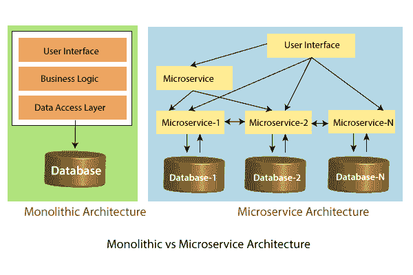

# 微服务教程

> 原文：<https://www.javatpoint.com/microservices>

**微服务架构**是面向服务的架构。在微服务架构中，有大量的**微服务**。通过组合所有的微服务，它构建了一个大服务。在微服务架构中，所有的服务都相互通信。

在**微服务**教程中，我们将了解如何使用**春云**实现微服务。我们将学习如何在微服务之间建立通信，**启用** **负载平衡**、**扩展和缩减微服务**。我们还将学习**用**Spring Cloud Config Server**集中配置微服务**。我们将通过**春云侦察****齐普金**实现**尤里卡命名服务器****分布式追踪**。我们将用 **Zipkin** 创建容错微服务。

我们的**微服务**教程讨论了**微服务架构**的基本功能以及相关示例，以便于理解。

## 什么是微服务

**定义**:根据**山姆·纽曼**“微服务是协同工作的小服务。”

根据**詹姆斯·刘易斯和马丁·福勒**“微服务架构风格是一种将单个应用程序开发为一套小型服务的方法。每个微服务都运行自己的进程，并与轻量级机制进行通信。这些服务是围绕业务能力构建的，由全自动部署机制独立开发。”

这些服务可以用不同的编程语言编写，并使用不同的数据存储技术，只有最低限度的集中管理。

## 需要记住的要点

*   这些是由 REST 公开的服务。
*   这些都是精心挑选的小型可部署单位。
*   这些服务必须支持云。

微服务定义了一种架构方法，该方法将应用程序划分为实现业务需求的松散耦合服务池。紧挨着**面向服务架构(SOA)** 。基于微服务的架构最重要的特点是，它可以执行大型复杂应用的**连续交付**。

微服务有助于打破应用程序，构建逻辑独立的较小应用程序。例如，我们可以用最少的努力在亚马逊 AWS 的帮助下构建一个云应用。

在上图中，每个微服务都有自己的业务层和数据库。如果我们在一个微服务中更改，它不会影响其他服务。这些服务通过使用轻量级协议(如 HTTP 或 REST 或消息协议)相互通信。

## 微服务原理

微服务有以下原则:

*   单一责任原则
*   围绕业务领域建模
*   隔离故障
*   基础设施自动化
*   独立部署

### 单一责任原则

单一责任原则规定程序中的一个类或一个模块应该只有一个责任。任何微服务都不能同时承担一项以上的责任。

### 围绕业务领域建模

微服务从不限制自己接受适当的技术堆栈或数据库。堆栈或数据库最适合解决业务目的。

### 孤立故障

大型应用程序几乎不受单个模块故障的影响。服务随时都有可能失败。所以，快速检测故障很重要，如果可能的话，自动恢复故障。

### 基础设施自动化

基础设施自动化是脚本环境的过程。借助脚本环境，我们可以将相同的配置应用于单个节点或数千个节点。它也称为配置管理、脚本化基础架构和系统配置管理。

### 独立部署

微服务与平台无关。这意味着我们可以在不影响其他服务的情况下独立设计和部署它们。

## 观众

我们的微服务教程是为软件专业人员和初学者设计的，他们希望轻松学习微服务架构。本教程将为您提供微服务架构及其组件的深入知识，如**Rabbtmq 服务器、尤里卡命名服务器、Zuul API 网关、Ribbon、Hystrix、**和 **Zipkin 服务器**。完成本教程后，您可以使用**春云**开发**微服务服务**。

## 先决条件

在继续学习本教程之前，您应该对 **Java** 、 **Spring、**和 **Spring Cloud** 框架有一个基本的了解。因为我们将使用 Spring Cloud 开发微服务。

## 问题

我们向您保证，您不会发现微服务教程有任何问题。如果有任何错误，请在联系表格中发布问题。

* * *