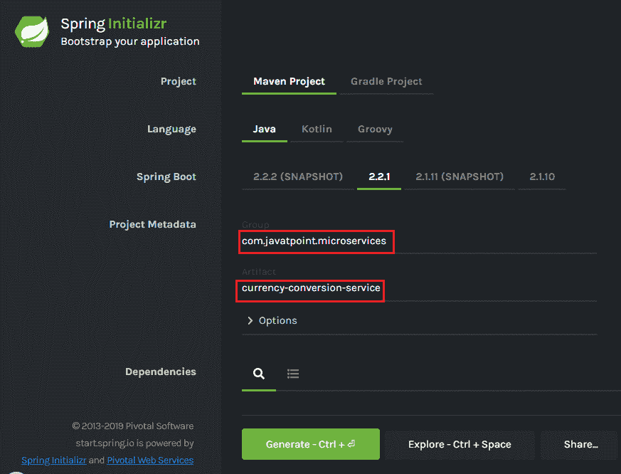

# 设置货币兑换微服务

> 原文：<https://www.javatpoint.com/setting-up-currency-conversion-microservice>

在前一节中，我们已经创建了货币兑换服务。现在我们将创建一个货币兑换服务，与货币兑换服务对话。

**第一步:**打开浏览器，输入[https://start.spring.io/](https://start.spring.io/)。

*   提供集团名称 **javatpoint.microservice** 和神器**货币兑换服务。**
*   添加依赖项: **Spring web、开发工具、执行器、**和**配置客户端**。
*   点击**生成**下载创建的项目。



**第二步**:在**春季工具套件(STS)** 中导入下载的项目。

文件->导入->现有 Maven 项目->下一步->浏览->选择项目->完成。

导入项目需要一些时间。

**步骤 3:** 打开**应用程序.属性**文件，配置**应用程序名称**和**端口**号。

**应用属性**

```java
spring.application.name=currency-conversion-service
server.port=8100

```

货币兑换服务在端口 **8100** 上运行。


在下一节中，我们将创建一个与货币兑换服务对话的服务。

## 为货币兑换服务创建服务

在上一节中，我们使用了欧元对印度卢比，这返回了**换算倍数**是多少。货币兑换服务告诉我们，当我们把货币从欧元兑换成印度卢比时，兑换值是多少。

在本节中，我们将创建 CurrencyCalculationService。它定义了许多与转换相关的功能。

我们将创建一个服务货币转换器，接受两个路径参数“**”从**、“**到**”。它还接受数量(我们想要转换的数量)。

让我们创建一个货币兑换服务。

**第一步:**创建一个名为**的类。**

**第二步:**添加注释 **@RestController。**

**步骤 3:** 创建一个**获取映射**。

**货币转换控制器. java**

```java
package com.javatpoint.microservices.currencyconversionservice;
import java.math.BigDecimal;
import org.springframework.web.bind.annotation.GetMapping;
import org.springframework.web.bind.annotation.PathVariable;
import org.springframework.web.bind.annotation.RestController;
@RestController
public class CurrencyConversionController 
{
@GetMapping("/currency-converter/from/{from}/to/{to}/ quantity/{quantity}") //where {from} and {to} represents the column 
//return a bean back
public CurrencyConversionBean convertCurrency(@PathVariable String from, @PathVariable String to, @PathVariable BigDecimal quantity)
{
return new CurrencyConversionBean(1L, from,to,BigDecimal.ONE, quantity,quantity,0 );
}
}

```

**步骤 4:** 创建一个名为**的类**并定义以下字段:

```java
private Long id;
private String from;
private String to;
private BigDecimal ConversionMultiple;
private BigDecimal quantity;
private BigDecimal totalCalculatedAmount;
private int port;

```

**第五步:**生成**吸气剂**和**设置剂**。

**第 6 步:**生成**构造函数**，同时创建**默认**构造函数。

**currency conversion bean . Java**

```java
package com.javatpoint.microservices.currencyconversionservice;
import java.math.BigDecimal;
public class CurrencyConversionBean 
{
private Long id;
private String from;
private String to;
private BigDecimal ConversionMultiple;
private BigDecimal quantity;
private BigDecimal totalCalculatedAmount;
private int port;
//default constructor
public CurrencyConversionBean()
{	
}
//creating constructor
public CurrencyConversionBean(Long id, String from, String to, BigDecimal conversionMultiple, BigDecimal quantity, BigDecimal totalCalculatedAmount, int port) 
{
super();
this.id = id;
this.from = from;
this.to = to;
ConversionMultiple = conversionMultiple;
this.quantity = quantity;
this.totalCalculatedAmount = totalCalculatedAmount;
this.port = port;
}
//creating setters and getters
public Long getId() 
{
return id;
}
public void setId(Long id) 
{
this.id = id;
}
public String getFrom() 
{
return from;
}
public void setFrom(String from) 
{
this.from = from;
}
public String getTo() 
{
return to;
}
public void setTo(String to) 
{
this.to = to;
}
public BigDecimal getConversionMultiple() 
{
return ConversionMultiple;
}
public void setConversionMultiple(BigDecimal conversionMultiple) 
{
ConversionMultiple = conversionMultiple;
}
public BigDecimal getQuantity() 
{
return quantity;
}
public void setQuantity(BigDecimal quantity) 
{
this.quantity = quantity;
}
public BigDecimal getTotalCalculatedAmount() 
{
return totalCalculatedAmount;
}
public void setTotalCalculatedAmount(BigDecimal totalCalculatedAmount) 
{
this.totalCalculatedAmount = totalCalculatedAmount;
}
public int getPort() 
{
return port;
}
public void setPort(int port) 
{
this.port = port;
}
}

```

**步骤 7:** 重新启动应用程序，并在浏览器中键入以下 URI:

**http://localhost:8100/货币转换器/from/USD/to/INR/quantity/1000**


在上面的回应中，“**从“**”“**到“**”和“**量”**变量从路径中拾取。我们已经对其他变量进行了硬编码。

下一步，从货币兑换服务开始，我们将称之为货币兑换服务。我们还将确定**换算倍数**是多少，并将使用该金额(**换算倍数**)计算**合计**金额。我们还将使用响应中的端口。

[Click here to download currency-conversion-service](https://static.javatpoint.com/tutorial/microservices/download/microservice/currency-conversion-service.zip)

* * *