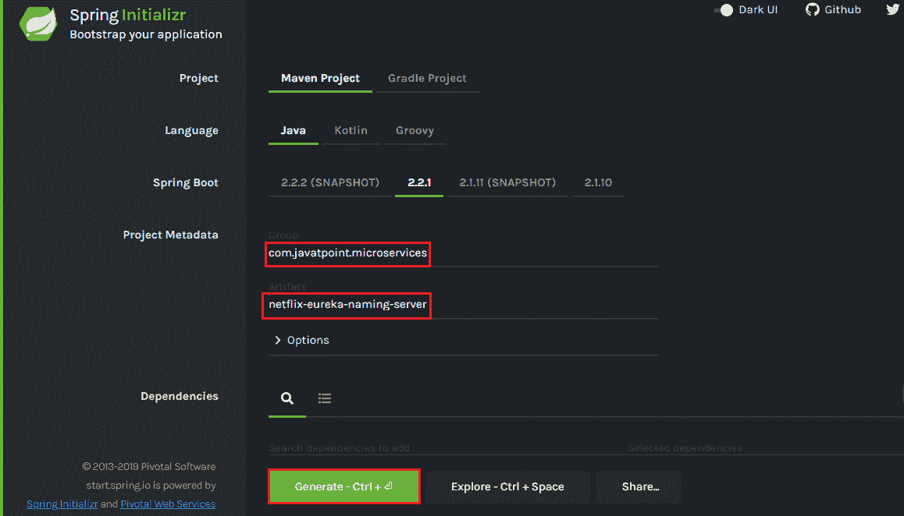
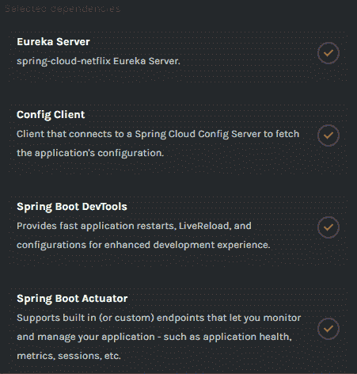
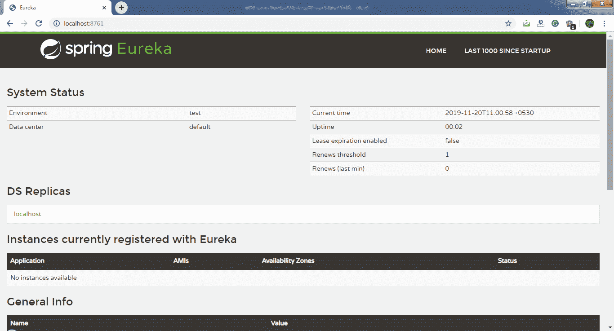

# 尤里卡命名服务器

> 原文:[https://www.javatpoint.com/eureka-naming-server](https://www.javatpoint.com/eureka-naming-server)

在上一节中，我们已经配置了**功能区**，并在两个服务之间分配了负载。在这一部分，我们将设置**尤里卡**命名服务器。

## 命名服务器

**命名服务器**是一个计算机应用程序，它实现了一个网络服务，用于响应对目录服务的查询。

## 尤里卡命名服务器

**尤里卡命名服务器**是一个基于 REST 的服务器，用于 **AWS 云**服务中，用于中间层服务的负载平衡和故障转移。

Eureka 命名服务器是一个保存所有客户服务应用程序信息的应用程序。每个微服务都向尤里卡命名服务器注册自己。命名服务器用其**端口号**和 **IP 地址**注册客户端服务。它也被称为**发现服务器。**尤里卡命名服务器自带春云的捆绑包。它运行在默认端口 **8761** 上。它还附带了一个基于 Java 的客户端组件，eureka 客户端，这使得与服务的交互变得更加容易。

## 命名服务器的需求

我们还有另一个负载平衡器应用程序，称为 **AWS 云**。由于其固有的性质，服务器时好时坏。没有中间层负载平衡器。尤里卡命名服务器填补了**客户端**和**中间层负载平衡器之间的空白。**

假设我们想要启动货币兑换服务的另一个实例 **CurrencyExchangeService3** ，并在端口 8002 上启动它。这里出现了一个问题，**丝带能把负荷分配给它吗？**

如果功能区想要将负载分配给新服务器，我们需要将其添加到配置中。根据负载，我们可以增加或减少服务实例的数量。

在本节中，我们将能够动态地增加或减少实例的数量。

如果我们继续在当前交换服务中进行更改，根据当前有多少个当前交换服务是活动的，那么，维护就变得非常困难。

当我们想让维护变得更容易时，尤里卡命名服务器就出现了。所有微服务的所有实例都将注册到**尤里卡**命名服务器。每当微服务的新实例出现时，它都会向尤里卡命名服务器注册。向命名服务器注册微服务称为**服务注册。**

每当一个服务想要与另一个服务对话时，假设 CurrencyExchangeService 想要与 CurrencyExchangeService 对话。当前计算服务首先与尤里卡命名服务器对话。命名服务器提供当前正在运行的 CurrencyExchangeService 实例。向其他服务提供实例的过程称为**服务发现。**

**服务注册**和**服务发现**是命名服务器的两个重要特性。下一步，我们将设置一个尤里卡命名服务器。

## 设置尤里卡命名服务器

设置尤里卡命名服务器涉及很多步骤，如下所示:

*   为尤里卡命名服务器创建一个组件
*   更新当前计算服务以连接到尤里卡命名服务器
*   将 CurrencyExchangeService 连接到尤里卡命名服务器
*   配置功能区

一旦货币兑换服务的实例在尤里卡命名服务器上注册，那么我们将使用功能区从命名服务器中查找详细信息。让我们遵循上面指定的步骤:

**为尤里卡命名服务器创建一个组件**

**第一步:**打开弹簧初始化器[。](https://start.spring.io)

**第二步:**提供**组**名称。我们提供了**网站. javatpoint .微服务**

**第三步:**提供**神器 Id** 。我们提供了**网飞-尤里卡-命名服务器。**



**步骤 4:** 添加以下依赖项:**尤里卡服务器、配置客户端、执行器、**和**开发工具。**



**第五步:**点击**生成**按钮。它下载一个 **zip** 文件。

**第六步:** **提取**zip 文件，将文件夹粘贴到 Spring Tool Suite (STS)工作区，然后**导入**即可。

文件->导入->现有 Maven 项目->下一步->浏览->选择**网飞-尤里卡-命名-服务器项目** - >完成


**第 7 步:**打开**NetflixEurekaNamingServerApplication.java**文件，使用注释**@enable 尤里卡服务器**启用尤里卡命名服务器。

**netflixeurekanminserverapplication . Java**

```java

package com.javatpoint.microservices.netflixeurekanamingserver;
import org.springframework.boot.SpringApplication;
import org.springframework.boot.autoconfigure.SpringBootApplication;
import org.springframework.cloud.netflix.eureka.server.EnableEurekaServer;
@SpringBootApplication
@EnableEurekaServer
public class NetflixEurekaNamingServerApplication 
{
public static void main(String[] args) {
SpringApplication.run(NetflixEurekaNamingServerApplication.class, args);
}
}

```

**步骤 8:** 打开**应用程序.属性**文件，配置**应用程序名称、端口、**和**尤里卡服务器**。

```java

spring.application.name=netflix-eureka-naming-server
server.port=8761
eureka.client.register-with-eureka=false
eureka.client.fetch-registry=false

```

端口 **8761** 是尤里卡命名服务器的默认端口。

**第 9 步:**运行**NetflixEurekaNamingServerApplication.java**文件作为 Java 应用程序。

**第十步:**打开浏览器，输入网址 [http://localhost:8761](http://localhost:8761) 。它显示了尤里卡服务器用户界面。



在本节中，我们已经创建了一个组件尤里卡命名服务器。在下一步中，我们将把微服务与尤里卡命名服务器连接起来。

[Click here to download netflix-eureka-naming-server](https://static.javatpoint.com/tutorial/microservices/download/eureka/netflix-eureka-naming-server.zip)

* * *