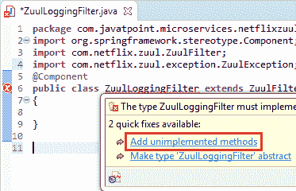

# 实现 Zuul 日志过滤器

> 原文:[https://www.javatpoint.com/implementing-zuul-logging-filter](https://www.javatpoint.com/implementing-zuul-logging-filter)

在前一节中，我们讨论了在应用编程接口网关中实现的常见功能。我们已经准备好了作为应用编程接口网关的 Zuul 服务器。

在本节中，我们将在 Zuul API 网关中实现日志功能。

让我们在 Zuul API 网关中实现日志记录。

**步骤 1:** 在**网飞-zuul-API-网关-服务器**项目中，创建一个名为**zuullogingfilter 的新类文件。**

**第二步:**添加注释 **@Componenet** 。

**第三步:**扩展 **ZuulFilter** 类。ZuulFilter 类中有一些抽象方法。这些抽象方法必须在 ZuulLoggingFilter 类中实现。

**第 4 步:**将光标移到**zuullogingfilter**类**上。**建议两个快速修复，如下图所示。点击**添加未实现的方法。**我们得到了 ZuulFilter 类所有抽象方法的默认实现。



**ZuulFilter** 类有下面列出的四个抽象方法:

*   **should filter():**should filter()方法检查请求并决定是否执行过滤器。
*   **run():**run()方法调用，如果两者都**！isFilterDisabled()** 和 **shouldFilter()** 方法返回 **true** 。
*   **filter type():**filter type()方法按类型对过滤器进行分类。Zuul 中有四种类型的标准过滤器:**前置**用于**前置路由过滤**、**路由**用于**路由至原点**、**后置**用于**后置路由过滤器**、**错误**用于**错误处理**。Zuul 还支持用于**静态响应的**静态**类型。**通过调用方法**运行过滤器(类型)，可以创建或添加并运行任何过滤器类型。**
*   **过滤顺序()**:必须为过滤器定义过滤顺序。如果优先级对于过滤器不重要，则过滤器可以具有相同的过滤器顺序。过滤顺序不需要是连续的。

**第 5 步:**创建 **Logger** 类对象，调用 **getLogger()** 方法创建一个 Logger。

```java

private Logger logger=LoggerFactory.getLogger(this.getClass());

```

**记住:**导入 **org.slf4j** 包的 **Logger** 类。

**第 6 步:**执行**运行()**方法中的逻辑。

```java

public Object run() throws ZuulException
{
//getting the current HTTP request that is to be handle
HttpServletRequest request=RequestContext.getCurrentContext().getRequest();
//printing the detail of the request
logger.info("request -> {} request uri-> {}", request, request.getRequestURI());
return null;
}

```

**祖鲁吉过滤器. java**

```java

package com.javatpoint.microservices.netflixzuulapigatewayserver;
import javax.servlet.http.HttpServletRequest;
import org.slf4j.Logger;
import org.slf4j.LoggerFactory;
import org.springframework.stereotype.Component;
import com.netflix.zuul.ZuulFilter;
import com.netflix.zuul.context.RequestContext;
import com.netflix.zuul.exception.ZuulException;
@Component
public class ZuulLoggingFilter extends ZuulFilter
{
//creating Logger object
private Logger logger=LoggerFactory.getLogger(this.getClass());
@Override
public booleanshouldFilter() 
{
return true; //executing filter for every request
}
//log the content of the request
@Override
public Object run() throws ZuulException
{
//getting the current HTTP request that is to be handle
HttpServletRequest request=RequestContext.getCurrentContext().getRequest();
//prints the detail of the requestin the log
logger.info("request -> {} request uri-> {}", request, request.getRequestURI());
return null;
}
@Override
public String filterType() 
{
return "pre"; //intercept all the request before execution
}
@Override
public intfilterOrder() 
{
return 1; //setting filter order to 1
}
}

```

在下一步中，我们将看到如何使用 Zuul 拦截请求。

[Click here to download currency-conversion-service](https://static.javatpoint.com/tutorial/microservices/download/logging/currency-conversion-service.zip)
[Click here to download currency-exchange-service](https://static.javatpoint.com/tutorial/microservices/download/logging/currency-exchange-service.zip)
[Click here to download netflix-eureka-naming-server](https://static.javatpoint.com/tutorial/microservices/download/logging/netflix-eureka-naming-server.zip)
[Click here to download netflix-zuul-api-gateway-server](https://static.javatpoint.com/tutorial/microservices/download/logging/netflix-zuul-api-gateway-server.zip)

* * *