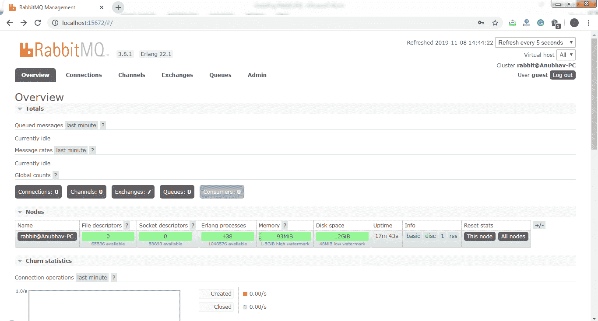

# 安装 RabbitMQ 服务器

> 原文:[https://www.javatpoint.com/installing-rabbitmq-server](https://www.javatpoint.com/installing-rabbitmq-server)

## 拉比特

**rabbtmq**是广泛部署的开源**消息代理**软件，实现**高级消息队列协议** (AQMP)。它重量轻，易于在云中部署。它支持多种消息协议。它可以部署在分布式环境中，以满足**高规模**和**高可用性**的要求。它以 AMQP 标准为模型。RabbitMQ 是用 **Erlang** 编程语言编写的。它是在**开放电信平台(OTP)** 框架上开发的，用于集群和故障转移。

RabbitMQ 运行在不同的操作系统和云环境中。它提供了大量像 **Java 这样的平台，。NET、Python、**等。

### 优势 rabbitmq

*   快速性能
*   多语种(使用多种语言)
*   易于管理
*   不需要二郎知识
*   伟大的文献

### AMQPdefines:

*   在哪里发送消息**(路由)**
*   如何到达**(发货)**
*   进去的必须出来**(保真)**

### 消息代理

消息代理位于机器和分布式计算系统之间。消息不是直接传递给接收者，而是首先发送给消息代理(RabbitMQ)。消息代理在优化的队列中对消息进行排序，并在机器准备好处理消息时将它们传递给接收机器。

消息可以是处理订单、运行指定任务的**命令，也可以是对数据库的拉取请求**。

发送信息的机器称为**生产者**。接收信息的机器被称为**消费者**。中间那位叫做**经纪人**。

消息代理执行以下操作:

*   **分离**消息发布者和消费者
*   **存储**消息
*   **路由**消息
*   **监控**和**管理**消息
*   **在生产者和消费者之间转换**消息格式

## 占线小时

**Erlang** 是一种**编译、容错、并发、动态类型化的**编程语言。它被用来构建一个对高可用性有要求的大规模可扩展的实时系统。用于**银行**、**电商**、**电信**、**电脑电话、**和**即时通讯**。

## 动态密码

OTP 代表**开放电信平台**。是**二郎图书馆**和**设计原则**的集合。它提供中间件来开发这些系统。它包括自己的工具，如**分布式数据库**、**应用程序接口到其他语言，调试**和**发布处理**工具。

## 如何在 Windows 上安装 RabbitMQ

**记住:**在安装 RabbitMQ 之前，我们需要先安装**二郎**。

**第一步:**从[https://erlang.org/download/otp_win64_22.1.exe](https://erlang.org/download/otp_win64_22.1.exe)下载安装**二郎**。

**第二步:**从[https://github . com/rabbtmq/rabbtmq-server/releases/Download/v 3 . 8 . 1/rabbtmq-server-3 . 8 . 1 . exe](https://github.com/rabbitmq/rabbitmq-server/releases/download/v3.8.1/rabbitmq-server-3.8.1.exe)下载并安装**rabbtmq**。

**第三步:**打开**命令提示符**，依次运行以下命令:

```java

c:\>cd\
c:\>cd Program Files
c:\Program Files>cd RabbitMQ Server
c:\Program Files\RabbitMQ Server>dir
c:\Program Files\RabbitMQ Server>cd rabbitmq_server-3.8.1
c:\Program Files\RabbitMQ Server\rabbitmq_server-3.8.1>dir
c:\Program Files\RabbitMQ Server\rabbitmq_server-3.8.1>cd sbin
c:\Program Files\RabbitMQ Server\rabbitmq_server-3.8.1\sbin>dir
c:\Program Files\RabbitMQ Server\rabbitmq_server-3.8.1\sbin>rabbitmq-plugins enable rabbitmq_management

```

**第四步:**按下窗口键并输入**服务**或按下**窗口键+R** 并输入**服务。**

**第 5 步:**选择**Rabbtmq**服务- >右键- >重启。


**第六步:**打开浏览器，输入 [http://localhost:15672](http://localhost:15672) 。默认情况下，管理插件运行在端口 **15672** 上。


**第七步:**提供**用户名**和**密码**，点击**登录**按钮**。**默认用户名和密码为**访客**。

下一页显示了 RabbitMQ 用户界面。



* * *