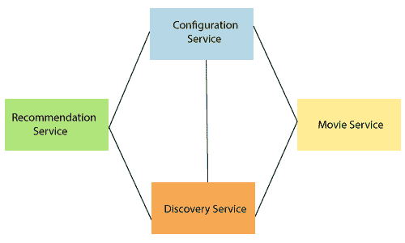

# 春云的特征

> 原文:[https://www.javatpoint.com/features-of-spring-cloud](https://www.javatpoint.com/features-of-spring-cloud)

春云最大的特点是它建立了 Spring Boot 的概念。Spring cloud 建立在 Spring 框架的一些常见构建块之上，如下所示:

*   智能路由和服务发现
*   服务对服务呼叫
*   负载平衡
*   领导选举
*   全局锁
*   分布式配置
*   分布式消息传递

### 智能路由和服务发现

在 Spring Cloud 上构建微服务时，首先要考虑的是前两个主要微服务:**配置服务**和**发现服务**。

上图为**四个微服务**的集合。每个服务之间的连接表示依赖关系。所有服务都是相互依赖的。配置服务位于顶部，发现服务位于底部。中间有两个微服务，分别是**推荐服务**和**电影服务**。

### 服务对服务呼叫

它是“一个微服务如何通过服务注册中心或尤里卡服务器与其他依赖的微服务进行通信”的过程服务对服务呼叫有一个顺序。

*   注册服务
*   正在获取注册表
*   寻找下游服务
*   解析底层 IP 地址
*   呼叫其余端点

### 负载平衡

负载平衡有效地将网络流量分配给多个后端服务器或服务器池。负载平衡的目标是最大化吞吐量、最小化响应时间、提高效率和优化资源使用。它**避免了任何单一资源的过载**。使用具有负载平衡的多个组件可以通过冗余增加**可靠性**和**可用性**。

### 领导选举

领导层选举允许应用程序通过第三方系统与其他应用程序一起工作。领导层选举用于在不牺牲可用性的情况下提供**全球状态**或**全球订购**。

### 全局锁

全局锁用于确保没有两个线程同时访问同一资源。程序员使用一种机制来消除这种情况，叫做**锁定**。每个线程首先**获取锁，对资源进行操作，**和**释放其他线程的锁**。

### 分布式配置

分布式配置是配置所有微服务的每个实例。“Spring cloud config server”为分布式系统中的外部化配置提供客户端支持。通过分布式配置，我们可以集中管理所有环境中应用程序的外部属性。

### 分布式消息传递

分布式消息传递系统提供了可靠性、可伸缩性和持久性的好处。消息模式遵循**发布-订阅**(发布-订阅)模型。在发布-订阅模型中，消息的发送者称为发布者，消息的接收者称为订阅者。**阿帕奇卡夫卡**和**拉比 tMQ** 是流行的高吞吐量消息传递系统。

* * *