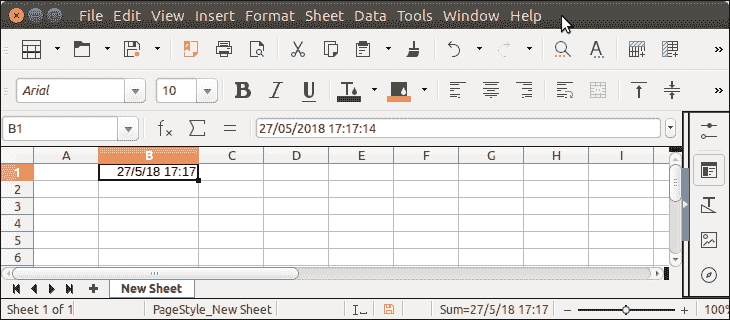

# 阿帕奇兴趣点 Excel 日期单元格

> 原文：<https://www.javatpoint.com/apache-poi-excel-date-cell>

要创建向单元格显示当前日期的日期单元格，我们可以使用 Apache POI 的样式功能根据日期格式化单元格。**设置日期格式()**方法用于设置日期格式。

让我们看一个例子，我们正在创建一个包含当前日期的单元格。

## 阿帕奇兴趣点 Excel 日期单元格示例

```java

package poiexample;
import java.io.FileNotFoundException;
import java.io.FileOutputStream;
import java.io.IOException;
import java.io.OutputStream;
import java.util.Date;
import org.apache.poi.hssf.usermodel.HSSFWorkbook;
import org.apache.poi.ss.usermodel.Cell;
import org.apache.poi.ss.usermodel.CellStyle;
import org.apache.poi.ss.usermodel.CreationHelper;
import org.apache.poi.ss.usermodel.Row;
import org.apache.poi.ss.usermodel.Sheet;
import org.apache.poi.ss.usermodel.Workbook;
public class DateCellExample {

	public static void main(String[] args) throws FileNotFoundException, IOException {
		Workbook wb = new HSSFWorkbook();
		CreationHelper createHelper = wb.getCreationHelper();
	    try(OutputStream os = new FileOutputStream("Javatpoint.xls")){
	        Sheet sheet = wb.createSheet("New Sheet");
	        Row row     = sheet.createRow(0);
	        Cell cell   = row.createCell(0);
	        CellStyle cellStyle = wb.createCellStyle();
	        cellStyle.setDataFormat(
	            createHelper.createDataFormat().getFormat("d/m/yy h:mm"));
	        cell = row.createCell(1);
	        cell.setCellValue(new Date());
	        cell.setCellStyle(cellStyle);
	        wb.write(os);
	    }catch(Exception e) {
	    	System.out.println(e.getMessage());
	    }
	}
}

```

**输出:**

