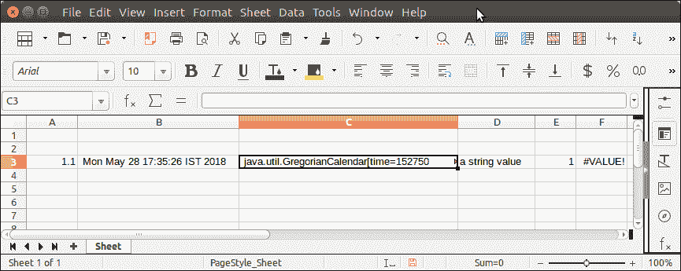

# 阿帕奇兴趣点 Excel 单元格类型

> 原文:[https://www.javatpoint.com/apache-poi-excel-cell-type](https://www.javatpoint.com/apache-poi-excel-cell-type)

为了在单元格中设置各种类型的值，Apache POI 提供了重载功能**设置单元格值()**，允许我们根据需要设置值。

在下面的例子中，我们创建了不同的单元格来保存不同类型的值。

## 阿帕奇兴趣点 Excel 单元格类型示例

```java

package poiexample;
import java.io.FileOutputStream;
import java.io.OutputStream;
import java.util.Calendar;
import java.util.Date;
import org.apache.poi.hssf.usermodel.HSSFWorkbook;
import org.apache.poi.ss.usermodel.CellType;
import org.apache.poi.ss.usermodel.Row;
import org.apache.poi.ss.usermodel.Sheet;
import org.apache.poi.ss.usermodel.Workbook;
public class CellTypeExample {
	public static void main(String[] args) {
		try (OutputStream os = new FileOutputStream("Javatpoint.xls")) {
		Workbook wb = new HSSFWorkbook();
	    Sheet sheet = wb.createSheet("Sheet");
	    Row row = sheet.createRow(2);                          
	    row.createCell(0).setCellValue(1.1); // Float value
	    row.createCell(1).setCellValue(" "+new Date()); // Date type 
	    row.createCell(2).setCellValue(" "+Calendar.getInstance());// Calendar
	    row.createCell(3).setCellValue("a string value"); // String
	    row.createCell(4).setCellValue(true); // Boolean
	    row.createCell(5).setCellType(CellType.ERROR); // Error
	    wb.write(os);
	    }catch(Exception e) {
	    	System.out.println(e.getMessage());
	    }
	}
}

```

**输出:**

