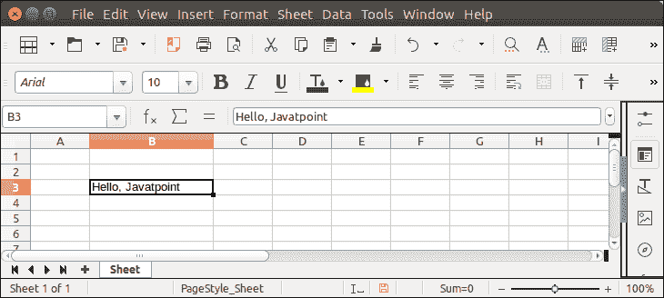
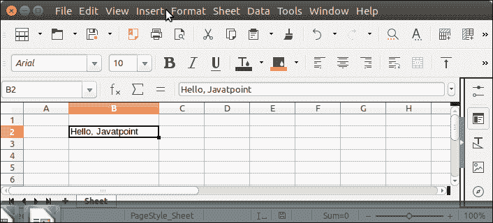

# 阿帕奇 POI 移位行

> 原文:[https://www.javatpoint.com/apache-poi-shift-row](https://www.javatpoint.com/apache-poi-shift-row)

为了将行从顶部移动到底部，反之亦然，Apache POI 提供了 shiftRows()方法来执行行移动。此方法需要移动起始行、结束行和行数。

让我们看一个例子来理解整个换档过程。

## 阿帕奇兴趣点移位行示例

```java

package poiexample;
import java.io.FileOutputStream;
import java.io.OutputStream;
import org.apache.poi.hssf.usermodel.HSSFWorkbook;
import org.apache.poi.ss.usermodel.Cell;
import org.apache.poi.ss.usermodel.Row;
import org.apache.poi.ss.usermodel.Sheet;
import org.apache.poi.ss.usermodel.Workbook;
public class ShiftRowsExample {
	public static void main(String[] args) {
		try (OutputStream os = new FileOutputStream("Javatpoint.xls")) {
			Workbook wb = new HSSFWorkbook();
	            Sheet sheet = wb.createSheet("Sheet");
			Row row     = sheet.createRow(1);
			Row row2    = sheet.createRow(2);
			Cell cell   = row.createCell(1);
			Cell cell2  = row2.createCell(1);
			cell2.setCellValue("Hello, Javatpoint");			
	        sheet.shiftRows(1, 2, -1);
	        wb.write(os);
	    }catch(Exception e) {
	    	System.out.println(e.getMessage());
	    }		
	}
}

```

**输出:**

轮班前



将一行移到顶部后。

