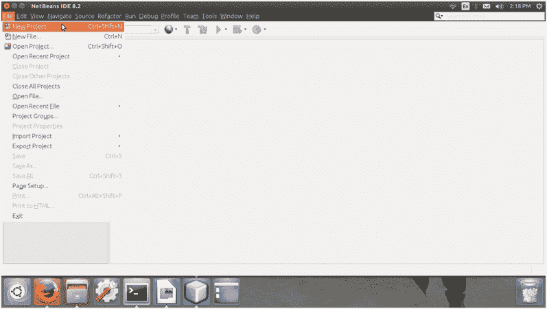
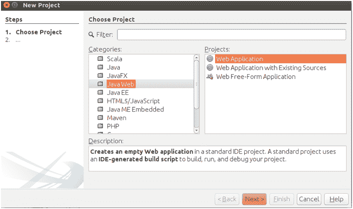
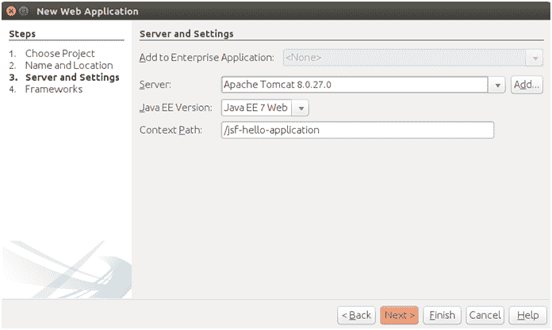
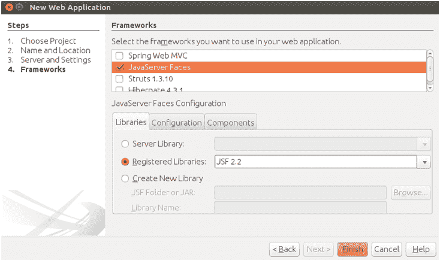
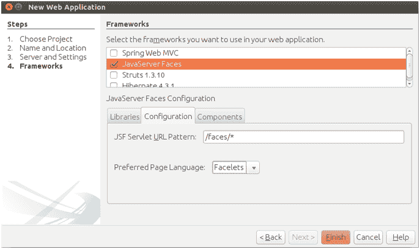
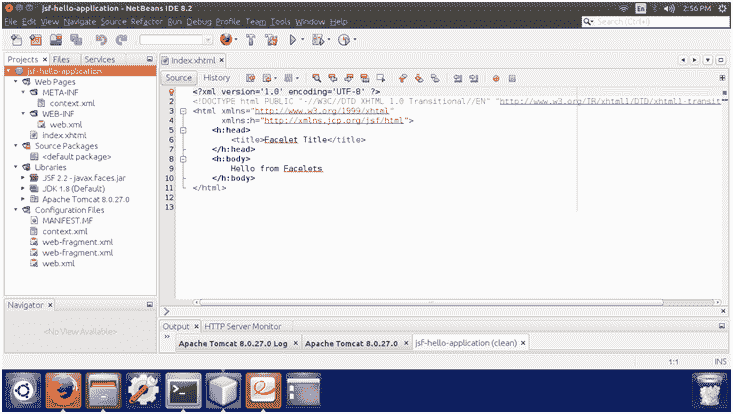
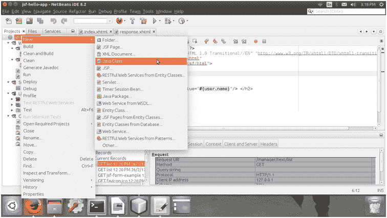
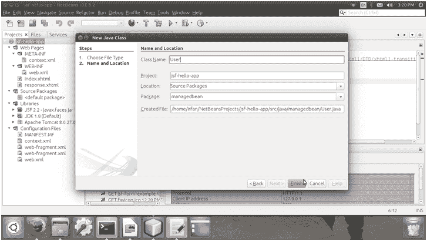
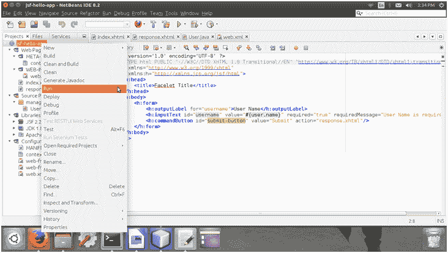

# 一个简单的 Java 服务器人脸应用

> 原文：<https://www.javatpoint.com/jsf-example>

为了创建一个 JSF 应用程序，我们使用了 NetBeans IDE 8.2。您也可以参考其他 Java IDEs。

在这里，我们正在创建一个项目，然后我们将运行测试它的配置设置。所以，让我们先创建一个新项目。

**第一步:创建新项目**

转到“文件”菜单，选择“新建项目”。



选择类别 Java 网络和项目网络应用程序。



输入项目名称。


选择服务器和 Java EE 版本。



选择 JSF 框架



选择首选页面语言:早期版本的 JSF 框架默认为 JSP 页面。现在，在最新的 2.0 版本和更高版本中，JSF 已经包含了强大的工具“Facelets”。所以，这里我们选择了页面语言作为 facelets。我们将在下一章更详细地讨论 facelets。



完成后，IDE 用默认的 Index.xhtml 文件为您创建一个 JSF 项目。Xhtml 是 html 的扩展，用于创建 facelets 页面。



**运行:**现在，右键单击项目后选择运行选项，即可运行应用程序。它将生成一条默认消息“来自 Facelets 的你好”。

我们成功地创建了 JSF 项目。该项目包括以下文件:

1.  **网页目录内的 index.xhtml:**
2.  **web.xml:** 在 WEB-INF 目录里面

每当我们运行该项目时，它都会将 index.xhtml 呈现为输出。现在，我们将创建一个包含两个网页、一个 bean 类和一个配置文件的应用程序。

开发新应用程序需要以下步骤:

1.  创建用户界面
2.  创建托管 beans
3.  配置和管理 FacesServlet

## 1)创建用户界面

我们将使用默认的 page index.xhtml 来呈现输入网页。如下所示修改您的 index.xhtml 源代码。

```java
// index.xhtml
<?xml version='1.0' encoding='UTF-8' ?>
<!DOCTYPE html PUBLIC "-//W3C//DTD XHTML 1.0 Transitional//EN""http://www.w3.org/TR/xhtml1/DTD/xhtml1-transitional.dtd">
<html 
xmlns:h="http://xmlns.jcp.org/jsf/html">
<h:head>
<title>User Form</title>
</h:head>
<h:body>
<h:form>
<h:outputLabel for="username">User Name</h:outputLabel>
<h:inputText id="username" value="#{user.name}" required="true" requiredMessage="User Name is required" /><br/>
<h:commandButton id="submit-button" value="Submit" action="response.xhtml"/>
</h:form>
</h:body>
</html>

```

创建产生输出的第二个网页。


创建 response.xhtml 页面后。现在，修改它的源代码如下。

// response.xhtml

```java
<?xml version='1.0' encoding='UTF-8' ?>
<!DOCTYPE html PUBLIC "-//W3C//DTD XHTML 1.0 Transitional//EN""http://www.w3.org/TR/xhtml1/DTD/xhtml1-transitional.dtd">
<html 
xmlns:h="http://xmlns.jcp.org/jsf/html">
<h:head>
<title>Welcome Page</title>
</h:head>
<h:body>
<h2>Hello, <h:outputText value="#{user.name}"></h:outputText></h2>
</h:body>
</html>

```

## 2)创建托管 Bean

它是一个包含属性和 getter setter 方法的 Java 类。JSF 用它作为模型。所以，你也可以用它来编写你的业务逻辑。





创建一个 Java 类后，将下面的代码放入您的 User.java 文件中。

//User.java

```java
package managedbean;
Facelet Title
import javax.faces.bean.ManagedBean;
import javax.faces.bean.RequestScoped;
@ManagedBean
@RequestScoped
public class User {
String name;

public String getName() {
return name;
}
public void setName(String name) {
this.name = name;
}
}

```

## 3)配置应用程序

要配置应用程序，project 包含一个 web.xml 文件，该文件有助于设置 FacesServlet 实例。您还可以设置您的应用程序欢迎页面和更多。

下面是这个应用程序的 web.xml 代码。

// web.xml

```java
<?xml version="1.0" encoding="UTF-8"?>
<web-app version="3.1"  
xmlns:xsi="http://www.w3.org/2001/XMLSchema-instance" xsi:schemaLocation="http://xmlns.jcp.org/xml/ns/javaee 
http://xmlns.jcp.org/xml/ns/javaee/web-app_3_1.xsd">
<context-param>
<param-name>javax.faces.PROJECT_STAGE</param-name>
<param-value>Development</param-value>
</context-param>
<servlet>
<servlet-name>Faces Servlet</servlet-name>
<servlet-class>javax.faces.webapFacelet Titlep.FacesServlet</servlet-class>
<load-on-startup>1</load-on-startup>
</servlet>
<servlet-mapping>
<servlet-name>Faces Servlet</servlet-name>
<url-pattern>/faces/*</url-pattern>
</servlet-mapping>
<session-config>
<session-timeout>
30
</session-timeout>
</session-config>
<welcome-file-list>
<welcome-file>faces/index.xhtml</welcome-file>
</welcome-file-list>
</web-app>

```

**嗯！一切就绪。现在运行应用程序。**



输出:

这是应用程序的索引页。


空字段的表单验证。


为输入文本提供输入。


这是提交输入(索引)页面后的响应页面。


* * *