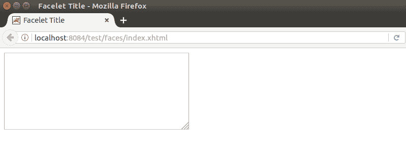

# JSF <inputtextarea>标签</inputtextarea>

> 原文：<https://www.javatpoint.com/jsf-inputtextarea>

JSF 将此呈现为一个 HTML“文本区域”元素。它允许用户输入多行字符串。

**例**

```java
<h:inputTextarea id="text-area-id" value="#{user.address}" required="true" 
requiredMessage="Address is required" cols="50" rows="10"></h:inputTextarea>

```

### JSF 将<inputtextarea>标记渲染如下:</inputtextarea>

```java
<textarea id="user-form:text-area-id"
name="user-form:text-area-id" cols="50" rows="10"></textarea>

```

输出:



### 属性

| 属性 | 描述 |
| 编号 | 它是此组件的标识符。此 id 必须唯一。你可以用它来访问 CSS 和 JS 文件中的 HTML 元素。 |
| 价值 | 它保存该组件的当前值。 |
| 关口 | 它用于设置文本区域的列数。 |
| 行 | 它用于设置 textarea 的行数。 |
| 需要 | 它指示用户需要为此输入组件提供提交的值。 |
| 所需消息 | 如果“必需”属性设置为“真”，则“必需消息”中提供的消息描述将显示在网页上。 |
| 有缺陷的 | 它用于禁用组件。您可以通过分配真值来禁用它。 |
| 单击事件 | 这是一个在点击 textarea 后调用 JavaScript 代码的方法。 |
| onselect | 这是一个当用户选择这个组件时调用 JavaScript 代码的方法。 |
| 只读的 | 它表示该组件禁止用户进行更改。通过将 readonly 作为该属性值传递，可以使组件成为只读的。例如，readonly =“readonly” |
| 提供 | 它用于呈现此组件。您可以将其值设置为真或假。默认值为真。 |
| 标签 | 它用于为此组件设置本地化名称。 |
| 语言 | 它用于为此组件设置语言。 |
| 风格 | 用于设置 CSS 样式代码，提供这个组件更好的用户界面。 |
| 访问密钥 | 按下时将焦点转移到此元素的访问键。它因浏览器而异。 |

* * *