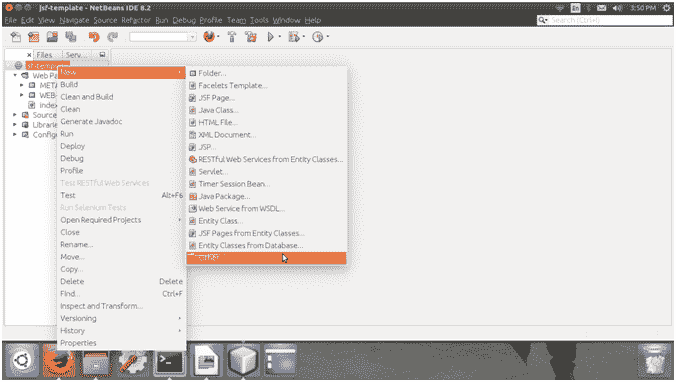
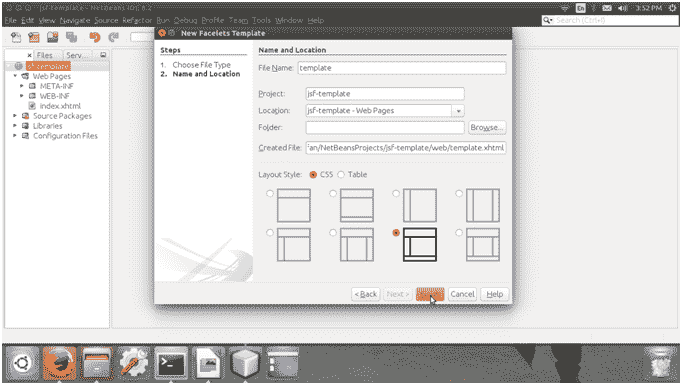
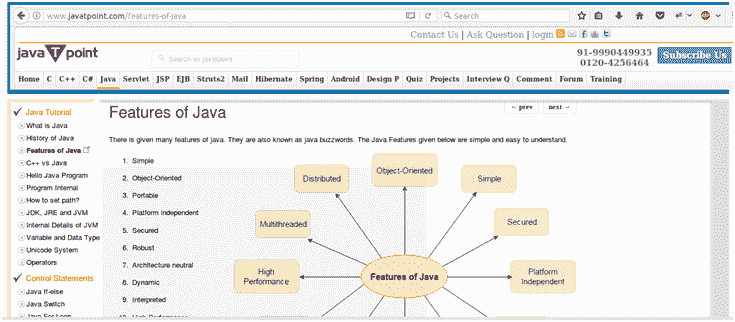

# 小面板模板

> 原文：<https://www.javatpoint.com/facelets-templates>

它是一个工具，提供了实现用户界面的工具。模板化是一个有用的 Facelets 特性，它允许您创建一个页面，作为应用程序中其他页面的基础。通过使用模板，您可以重用代码并避免一次又一次地重新创建类似的页面。模板化还有助于在有大量页面的应用程序中保持标准的外观。

下表包含用于创建模板的 Facelets 标记。

### 模板标签

| 标签 | 功能 |
| ui:组件 | 它用于定义创建并添加到组件树中的组件。 |
| 用户界面:合成 | 它用于定义可选使用模板的页面组合。此标签之外的内容将被忽略。 |
| 用户界面:调试 | 它用于定义创建并添加到组件树中的调试组件。 |
| ui:装饰 | 它类似于 composition 标记，但不忽略该标记之外的内容。 |
| 不明确的 | 它用于定义由模板插入页面的内容。 |
| ui:片段 | 它类似于组件标签，但不忽略该标签之外的内容。 |
| 用户界面:包括 | 它用于封装和重用多个页面的内容。 |
| 用户界面:插入 | 它用于将内容插入模板。 |
| ui:停止 | 它用于将参数传递给包含的文件。 |
| ui:重复 | 它被用作循环标记的替代，如 c:forEach 或 h:dataTable。 |
| 用户界面:删除 | 它用于从页面中移除内容。 |

## 创建小面模板

创建模板包括以下步骤。在这里，我们使用网络 Bean IDE 来创建 Facelets 模板。

1)创建新文件。



2)分别从类别和文件类型中选择 JavaServer Faces 和 Facelets Template。


3)为 Facelets 模板文件选择 CSS 布局。



Facelets 标签库包括主模板标签 ui:insert。使用此标签创建的模板页面允许您定义页面的默认结构。我们可以使用模板页面作为其他页面的模板。

// template.xhtml

```java
<!DOCTYPE html PUBLIC "-//W3C//DTD XHTML 1.0 Transitional//EN""http://www.w3.org/TR/xhtml1/DTD/xhtml1-transitional.dtd">
<html 
xmlns:ui="http://xmlns.jcp.org/jsf/facelets"
xmlns:h="http://xmlns.jcp.org/jsf/html">
<h:head>
<meta http-equiv="Content-Type" content="text/html; charset=UTF-8" />
<h:outputStylesheet name="./css/default.css"/>
<h:outputStylesheet name="./css/cssLayout.css"/>
<title>Facelets Template</title>
</h:head>
<h:body>
<div id="top">
<ui:insert name="top">Top</ui:insert>
</div>
<div>
<div id="left">
<ui:insert name="left">Left</ui:insert>
</div>
<div id="content" class="left_content">
<ui:insert name="content">Content</ui:insert>
</div>
</div>
<div id="bottom">
<ui:insert name="bottom">Bottom</ui:insert>
</div>
</h:body>
</html>

```

上面的模板文件分为四个部分:顶部、左侧、内容和主要部分。我们可以在应用程序的其他页面中进一步重用这种结构。

// index.xhtml

```java
<!DOCTYPE html PUBLIC "-//W3C//DTD XHTML 1.0 Transitional//EN""http://www.w3.org/TR/xhtml1/DTD/xhtml1-transitional.dtd">
<html 
xmlns:h="http://xmlns.jcp.org/jsf/html"
xmlns:ui="http://xmlns.jcp.org/jsf/facelets">
<h:head>
<meta http-equiv="Content-Type"
content="text/html; charset=UTF-8" />
<h:outputStylesheet library="css" name="default.css"/>
<h:outputStylesheet library="css" name="cssLayout.css"/>
<title>Facelets Template Example</title>
</h:head>
<h:body>
<ui:composition template="./template.xhtml">
<ui:define name="header">
<h:graphicImage value="/resourcimg/header.png"/>
</ui:define>

<ui:define name="index">
<h:graphicImage value="/resourcimg/index.png"/>
</ui:define>

<ui:define name="content">
<h:graphicImage value="/resourcimg/content.png"/>
</ui:define>
<ui:define name="footer">
<h:graphicImage value="/resourcimg/footer.png"/>
</ui:define>
</ui:composition>
</h:body>
</html>

```

在索引文件中，我们使用了 png 图像来表示模板布局。您可以放置自己的图像来执行此项目。

**ui:composition** 标签用于实现模板进入 index.xhtml 文件。

**ui:定义**标签用于将内容插入到实现的模板中。

输出:

//索引页



* * *