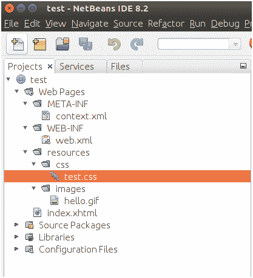

# JSF 网络资源

> 原文：<https://www.javatpoint.com/jsf-web-resources>

JSF web 资源是在 web 应用程序中正确呈现所需的资源。它包括图像、脚本文件和任何用户创建的组件库。

JSF 提供了一种标准的方式来存储您的网络资源。您可以使用以下任意一种方式来存储资源。

*   它必须存储在 web 应用程序根目录下资源目录的子目录中:resources/resource-identifier。
*   打包在 web 应用程序类路径中的资源必须位于 web 应用程序内的 META-INF/resources 目录的子目录中:META-INF/resources/resource-identifier。您可以使用这个文件结构将资源打包到捆绑在 web 应用程序中的 JAR 文件中。

JavaServer Faces 运行时将按顺序在前面列出的位置查找资源。

* * *

## JSF 网络资源示例:访问图像文件

JSF 提供< **h:graphicImage /** >标签来访问 web 应用程序中的 Image。在下面的例子中，首先我们创建了一个资源和一个名为 images 的子文件夹。创建文件夹后，我们的应用程序结构如下所示。


现在，您可以像下面这样编写代码。<graphicimage>标记指定名为 hello.gif 的图像位于目录网页/资源/图像中。</graphicimage>

// index.xhtml

```java
<h:body>
<h:form id="user-form" enctype="multipart/form-data">
<h:graphicImage value="#{resource['images:hello.gif']}"/>
<h:graphicImage library="images" name="hello.gif"/>
</h:form>
</h:body>

```

在这段代码中，我们通过两种方式访问图像。一种是在表达式语言中使用资源数组。其次，通过指定库属性。

输出:

两个图像标签产生相同的输出。


## JSF 网络资源示例:访问 CSS 文件

<**h:output 样式表** >标记用于访问 web 应用程序中的 CSS 资源。您必须在 resources 文件夹中创建一个子目录，如下所示。



在下面的例子中，我们正在访问网页中的 test.css 文件。

// index.xhtml

```java
<html 
xmlns:h="http://xmlns.jcp.org/jsf/html">
<h:head>
<title>Web Resources Example</title>
<h:outputStylesheet library="css" name="test.css"/>
</h:head>
<h:body>
<h1>Welcome to The JavaTPoint!</h1>
</h:body>
</html>

```

// test.css

```java
h1 {
color: red;
text-align: center;
}

```

输出:


* * *

## JSF 网络资源示例:访问 JavaScript 文件

< **h:outputScript** >标记用于访问 web 应用程序中的 JavaScript 文件。下面的截图显示了 JavaScript 文件在项目中的位置。


这里我们是借助<outputscript>标签访问 JavaScript 文件。</outputscript>

// index.xhtml

```java
<html 
xmlns:h="http://xmlns.jcp.org/jsf/html">
<h:head>
<title>Web Resources Example</title>
<h:outputScript  library="js" name="test.js"/>
</h:head>
<h:body>
</h:body>
</html>

```

// test.js

```java
window.onload = function(){
alert("Welcome to The JavaScript");
}

```

输出:


* * *